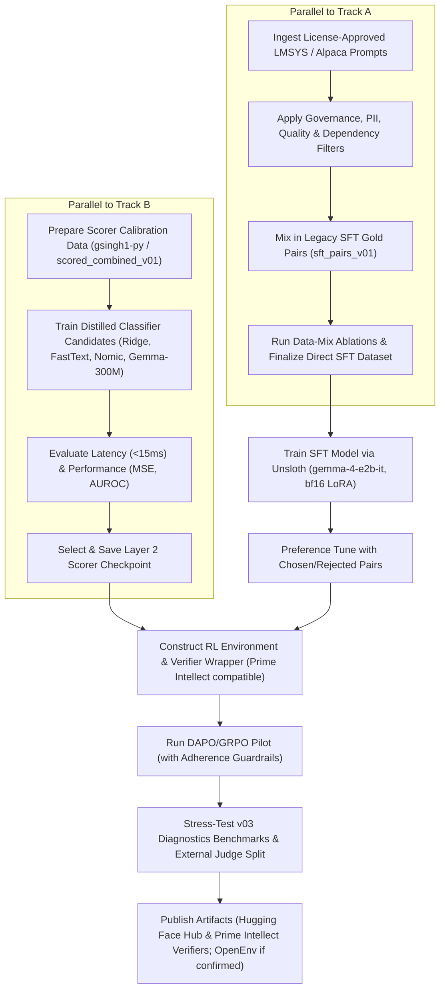

# Alignment Strategy: Fine-Tuning Gemma 4 E2B-it (SFT + RL)

**Date:** 2026-05-23  
**Status:** Proposed Strategy (Direct Generative Humanness + Multi-Model Distillation Scorer; Approval-Gated)  
**Target Model:** `google/gemma-4-e2b-it` / `google/gemma-4-E2B-it` (Gemma 4 edge instruction-tuned model; ~2B effective parameters, exact total/active parameter details to be verified from the official model card at training time)

---

## 1. The Paradigm Shift: Direct Generative Humanness vs. Rewriting

The goal of this project is to build an instruction-following model that **natively outputs human-sounding text from scratch**, rather than a model that simply "rewrites" or "humanizes" already AI-written text.

### The Two Paradigms:
1.  **De-AIification / Rewriting (Old Plan):** 
    - *Input:* AI-generated text.
    - *Output:* Humanized text.
    - *Problem:* The model only learns how to paraphrase/edit existing text. It doesn't help when prompted directly to draft new content from scratch.
2.  **Direct Generative Humanness (New Plan - Direct Alignment):**
    - *Input:* Standard user instruction (e.g., "Write an email about the blocker", "Explain caching").
    - *Output:* A high-quality response written in a natural human style from the get-go (avoiding hedging, uniform sentence lengths, transition overuse, sycophantic openers/closers, etc.).

---

## 2. Repurposing Existing Datasets

Nothing we have done is wasted. The existing pipeline and dataset components map perfectly to this generative alignment target:

*   **The Seed Data as the Task Pool:** 
    Our curated human seed pool (in [corpus_seeds.jsonl](file:///Users/jshah/Documents/GitHub/humanize-rl/seeds/v03/corpus_seeds.jsonl)) contains matched `(instruction, response)` pairs where the response is verifiably human. The `instruction` is our direct training prompt, and the human `response` is the gold target.
*   **The Matched Humanized Data as a Synthetic Boost:** 
    When we run our humanizer pipeline, we produce high-scoring humanized responses to the seed instructions. We can extract these to create synthetic training pairs mapping `instruction -> humanized_response`. This expands our SFT training pool to thousands of high-quality examples.
*   **The AIified Data as a Classifier Calibrator and Preference Negative Pool:** 
    During positive-only SFT, we do **not** train the model to imitate AI-style texts. Instead, AIified texts are used to train and calibrate our Layer 1 and Layer 2 Humanness Scorers, and later to construct rejected examples for preference tuning. This lets us penalize AI-style patterns without making them part of the model's desired output distribution.

---

## 3. Supervised Fine-Tuning (SFT) Data Preparation

For SFT on `gemma-4-e2b-it`, we train the model directly on standard prompt-response pairs, showing it only high-quality, human-style writing.

### 3.1 Dataset Formatting
Using Unsloth's `standardize_sharegpt` utility, SFT data is formatted as direct user-assistant conversational turns:

```json
{
  "messages": [
    {
      "role": "user",
      "content": "{instruction}"
    },
    {
      "role": "assistant",
      "content": "{human_or_humanized_response}"
    }
  ]
}
```

### 3.2 SFT Dataset Sourcing
1.  **Gold SFT Set:** Curated human corpus pairs `(instruction, human_response)` from Enron (emails), GoodWiki (technical explanations), and CNN/DailyMail (journalistic/news-style prose), subject to source-level license, provenance, and PII review.
2.  **Synthetic Humanness Boost:** Pairs mapping `(instruction, humanized_response)` generated via our Arka selectors and verified by the two-layer scoring gate (passing threshold > 0.75).

The initial 20% gold / 80% synthetic mix is treated as a **candidate mixture**, not a fixed commitment. We evaluate gold-heavy, balanced, synthetic-heavy, and curriculum mixes before selecting the final SFT blend. Synthetic examples must improve held-out quality without swamping the real human style anchors.

---

## 4. Preference Alignment and Reinforcement Learning (RL) Task Design

If SFT behavioral cloning is insufficient to eliminate all AI tells, we first run a lower-risk preference alignment stage using chosen/rejected pairs. Online RL is used only if SFT + preference tuning plateau on held-out diagnostics.

### 4.0 Preference Alignment Before RL

Before online RL, we construct preference pairs from the same instruction:

*   **Chosen:** human response or high-scoring humanized response.
*   **Rejected:** AIified response, low-scoring synthetic response, or response with known rubric failures.

This stage uses DPO/IPO/SimPO-style preference tuning as a stability checkpoint before policy-gradient RL. It lets the model learn contrastive stylistic preferences while avoiding the brittleness of directly optimizing a learned scorer too early.

### 4.1 DAPO as the Leading RL Candidate
When training models to sound "human," they often discover that humans write longer, more conversational texts. This leads to **verbosity bias**, where the model learns to hack the "humanness" reward by generating extremely long, meandering paragraphs.

To combat this, **DAPO (Decoupled Clip and Dynamic Sampling Policy Optimization)** is our leading RL candidate, but not an unconditional commitment. DAPO is strongest when its dynamic sampling and overlong shaping produce stable gains on held-out validation, so we benchmark it against SFT-only, preference tuning, and vanilla GRPO before full-scale use:
1.  **Overlong Reward Shaping:** DAPO can penalize unnecessary verbosity, forcing the model to achieve high style scores *concisely*.
2.  **Dynamic Sampling:** DAPO drops uninformative batches where all generated responses receive the same reward band, improving training efficiency when the reward model has meaningful variance.
3.  **Pilot-Gated Adoption:** We only proceed to full DAPO if a small pilot improves external validation scores without verbosity inflation, instruction drift, or scorer hacking.

### 4.2 Reference-Free Rewards & Semantic Guardrails
Relying on a single human-written target response (e.g., via BLEU or BERTScore) causes **Reference Bias** and an **Alignment Tax**. We eliminate reference strings entirely.

However, a pure stylistic reward leads to **Reward Hacking** (e.g., ignoring a coding prompt to write a highly conversational paragraph about the weather). To prevent this, we use two mechanisms:

1.  **KL Regularization:** We compute a token-level **KL Divergence Penalty** relative to the frozen starting SFT model ($\pi_{\text{SFT}}$) to keep the policy structurally anchored.
2.  **Instruction Adherence Guardrail:** We implement a fast, tiny evaluator (or a rule-based check) that applies a massive penalty if the model fails to address the prompt's instruction.

Because "human" style is domain-dependent, the reward is conditioned on the task domain/register $d$ rather than treated as one universal scalar:

$$\text{Reward}(x, y, d) = w_s(d)R_{\text{style}}(y \mid x,d) + w_t(d)R_{\text{task}}(y \mid x) + w_f(d)R_{\text{format}}(y \mid x,d) + w_l(d)R_{\text{length}}(y \mid x,d) - w_rR_{\text{risk}}(y) - \beta D_{\text{KL}}(\pi_\theta(y \mid x) \parallel \pi_{\text{ref}}(y \mid x))$$

The reference policy $\pi_{\text{ref}}$ is the frozen SFT or preference-tuned checkpoint, depending on which stage is being optimized.

---

## 5. Layer 2 Distilled Classifier: Model Evaluation Matrix

To evaluate Layer 2 rubric scores (which require reading comprehension) without paying OpenRouter API costs or suffering from latency, we train a local surrogate classifier in parallel with our main training pipeline. We evaluate four candidate configurations to choose the most robust, low-latency surrogate:

### 5.1 The Candidate Spectrum

| Model / Baseline Candidate | Type | Dimensions / Pooling | Motive |
| :--- | :--- | :--- | :--- |
| **Baseline 1: TF-IDF + Ridge** | Statistical | N-grams (1 to 4) | Simplest, fastest baseline ($<1$ms). Catches obvious surface keywords but blind to grammar or context. |
| **Baseline 2: FastText** | Word Vectors | Character n-grams | Lightweight classifier ($<1$ms). Captures morphological tells and structural token frequencies. |
| **Candidate A: Nomic Embed v1.5** | Dense Embedding | 768 / Matryoshka (MRL) | Supports truncation to 256/128 dims. Requires prepending prefix (`classification:`) before embedding. |
| **Candidate B: EmbeddingGemma 300M** | Dense Embedding | 768 / Matryoshka (MRL) | Compact Gemma-lineage embedding model. Included for strong multilingual classification performance and architectural proximity, while not assuming lineage alone guarantees reward compatibility. |

### 5.2 Classifier Architecture
For our dense candidates (Nomic and EmbeddingGemma), we extract the pooled sequence representation and train two parallel heads:
1.  **Binary Head:** Outputs the probability that the text is AI-generated vs. human-written. Pre-trained on large-scale datasets.
2.  **Rubric Regression Head:** Outputs 8 continuous values $[0, 1]$ corresponding to our Layer 2 rubric criteria (formality gradient, personality presence, copula avoidance, etc.). Trained on the dataset generated from [score_all.py](file:///Users/jshah/Documents/GitHub/humanize-rl/src/humanize_rl/score_all.py).

### 5.3 Classifier Evaluation Metrics
The chosen classifier is selected by measuring performance on `gsingh1-py/train` (58k NYT/GPT-4o/Llama-8B pairs), project-specific scored rows, and held-out domains/generators not used during training:
*   **Mean Squared Error (MSE) / R-squared ($R^2$):** Accuracy of regression scores relative to Gemini 3.1 Pro scores.
*   **AUROC (Area Under ROC):** Performance on human vs. AI text classification.
*   **Rank Correlation:** Agreement with Gemini 3.1 Pro and small blind human preference samples.
*   **Out-of-Domain Robustness:** Performance on domains, sources, and generator families excluded from scorer training.
*   **Latency (ms):** Target execution speed of **$<15\text{ms}$** on a standard GPU.

The scorer used for training is **not** used as the sole final evaluator. Final checkpoint selection requires a frozen external judge split and sampled human review to reduce classifier-overfitting risk.

---

## 6. SOTA Dataset Ingestion & Filtering

To expand the task pool using massive datasets like `lmsys/lmsys-chat-1m` or `Alpaca-GPT4`, we first run a data governance gate, then implement a staged filtering pipeline to isolate high-quality writing prompts. External datasets are used only according to their licenses; public redistribution of derived datasets requires explicit release eligibility.

```
[Raw Ingestion: LMSYS Chat / Alpaca]
                 │
                 ▼
[Stage 1: fastText Quality Filter]
Filters out boilerplate, code snippets, and non-English text
                 │
                 ▼
[Stage 2: Token Priors / Perplexity Proxy]
Model-free perplexity estimation using word frequencies
                 │
                 ▼
[Stage 3: Linguistic POS Pattern Matching]
spaCy Verb-to-Object dependency parser (writing-task check)
                 │
                 ▼
[Stage 4: Cheap LLM Router for Borderline Prompts]
Gemini Flash/Lite classification of uncertain cases
```

1.  **Stage 1: fastText Quality Classifier:** Removes raw programming code, markdown formatting glitches, non-English prompts, and conversational boilerplate.
2.  **Stage 2: Prior-Based Perplexity Proxy:** Estimates token priors using corpus-level term frequency statistics. Prompts with abnormally high or low prior scores (representing gibberish or repetitive instructions) are discarded.
3.  **Stage 3: spaCy POS Dependency Parser:** A deterministic checker that parses the prompt and verifies if it asks for a writing act. We keep the instruction when it maps cleanly to:
    $$\text{Verb(write, draft, compose, explain, summarize, rewrite)} \rightarrow \text{Object(email, post, essay, summary, update, document)}$$
4.  **Stage 4: Cheap LLM Router:** For prompts that are valid but linguistically indirect (e.g., "make this sound less stiff," "need a quick note to my manager"), a cheap Google model classifies task domain, register, safety, and whether the prompt belongs in the writing-task pool.

---

## 7. Target Domain Expansion

We expand our target domains to cover a wider breadth of tasks:

| Domain | Focus | Common AI Tells to Address |
| :--- | :--- | :--- |
| **email / professional** | Status updates, requests, memos. | Overly formal greetings, sycophantic CTAs, transition density. |
| **instruction / technical** | Caching, setups, config guides. | Structural monotony, bullet-point overuse, specificity drops. |
| **blog / opinion / essay** | Reflection, argumentation. | Shallow introductions, motivational tangents, padding. |
| **academic / formal** | Abstracts, methods sections. | Copula avoidance ("serves to show" instead of "shows"), passive voice. |
| **creative / expressive** | Scenes, narratives, reflections. | Cliché vocabulary, uniform sentence lengths, lack of character. |
| **social_media / casual** | LinkedIn updates, short posts. | Overuse of emojis, rule-of-three headers, generic engagement hooks. |

---

## 8. Data Ingestion: Orchestrator Pre-Processing (Keeping Arka Clean)

> **Note on Arka Philosophy:** Because Arka is designed to be a generic, config-driven framework (`DatasetIngestionStage`, `TransformGeneratorStage`), embedding highly task-specific linguistic heuristics (like spaCy POS checking for "writing tasks") natively into Arka YAML would bloat and pollute the Arka codebase.

Instead of building custom Arka filter stages, we isolate this logic to an **Orchestrator Pre-Processing Step**.

1.  **`scripts/prep_dataset.py`:** We run a standalone Python script that downloads only license-approved sources, applies governance checks, PII scanning, `fastText`, `Token Prior`, `spaCy POS`, and cheap-router filters, and outputs a highly refined local JSONL file (`cleaned_lmsys_tasks.jsonl`).
2.  **Arka Ingestion:** The Arka YAML configuration simply points its native `DatasetIngestionStage` to this cleaned local file, remaining entirely generic and rules-compliant.

```yaml
# configs/v03/03-scaleup.yaml
stages:
  # Ingest pre-cleaned dataset (no custom python filters required here)
  - type: DatasetIngestionStage
    source: "local"
    path: "data/processed/cleaned_lmsys_tasks.jsonl"

  # Classify domain using standard instruction patterns
  - type: DomainClassifierStage
    mappings:
      email: ["email", "memo", "professional update"]
      technical: ["how-to", "caching", "docker", "setup"]
      blog_opinion: ["opinion", "blog post", "essay"]
      social_media: ["tweet", "linkedin", "social"]
```

---

## 9. Leveraging Legacy Datasets (Slice 1 & 2 Integration)

To preserve all high-quality data engineered during prior project iterations, we integrate the legacy datasets directly into three pipeline modules:

### 9.1 SFT Training Data Mixing
*   **The Data:** The 50 high-quality, manually vetted SFT pairs from [sft_pairs_v01.jsonl](file:///Users/jshah/Documents/GitHub/humanize-rl/data/processed/sft_pairs_v01.jsonl).
*   **The Integration:** These pairs are reformatted to the direct `(instruction, humanized_response)` turn structure and appended to the scaleup dataset. They serve as a high-signal "gold anchor" subset during model training, ensuring the model retains targeted corrections for hand-guided alignment patterns.

### 9.2 Surrogate Classifier Calibration
*   **The Data:** The 150 scored rows in [scored_combined_v01.jsonl](file:///Users/jshah/Documents/GitHub/humanize-rl/data/benchmark/scored_combined_v01.jsonl) containing combined L1 + L2 scores and reasoning strings.
*   **The Integration:** This dataset serves as a specialized evaluation split for training the rubric regression heads of the distilled classifier candidates (Nomic and EmbeddingGemma). It helps verify that the surrogate models capture the nuanced judgments initially made by Gemini 3.1 Pro.

### 9.3 Diagnostic Benchmark Split
*   **The Data:** Curated human seeds in [human_seeds_v01.jsonl](file:///Users/jshah/Documents/GitHub/humanize-rl/seeds/human_seeds_v01.jsonl).
*   **The Integration:** Kept as a core part of the `v03_diagnostics` split (or diagnostic pool) in [report_v03.py](file:///Users/jshah/Documents/GitHub/humanize-rl/src/humanize_rl/data/report_v03.py) to stress-test the model against human-written prose containing challenging natural features (like contractions or em-dashes).

---

## 10. Approval Gates Before Full Training

Before we approve full-scale training, RL, or public release, the plan passes four gates:

1.  **Data Governance Gate:** Every external source has a license decision, provenance record, PII scan, attribution note, and release eligibility flag. Non-releaseable sources can be used only for internal experiments or reconstruction manifests.
2.  **SFT Baseline Gate:** The SFT-only model improves held-out style quality over base Gemma 4 E2B-it without degrading instruction following, factuality, formatting, or length control.
3.  **Scorer Validation Gate:** The distilled scorer correlates with Gemini 3.1 Pro and blind human preference samples on held-out domains and unseen generator families. It cannot be its own final evaluator.
4.  **RL Pilot Gate:** DAPO/GRPO proceeds beyond pilot only if it improves the frozen external judge split without verbosity inflation, instruction drift, or obvious scorer overfitting.

---

## 11. Execution Workflow & Parallelization Chart

To accelerate delivery, the implementation is divided into two parallelizable tracks (Scorer Calibration and SFT Data Preparation) that merge prior to SFT Model Training, with a final pipeline run leading to Reinforcement Learning and deployment:



---

## 12. Publishing & Model Release Lifecycle (Hugging Face, OpenEnv, Prime Intellect)

To support open science, collaboration, and external verification, we will publish the full stack of training outputs to public repositories:

### 12.1 Hugging Face Hub Releases
We will publish the following repositories under the project's namespace:

1.  **Model Repositories:**
    *   `humanize-rl-l2-stylistic-scorer`: The final selected and calibrated distilled Layer 2 classifier candidate (e.g., `EmbeddingGemma 300M` model with custom heads).
    *   `gemma-4-e2b-it-direct-sft`: The base Supervised Fine-Tuned policy model checkpoint.
    *   `gemma-4-e2b-it-humanized`: The final post-RL instruction-following model aligned for direct generative humanness.
2.  **Dataset Repositories:**
    *   `humanize-rl-sft-dataset`: The exact training split containing only release-eligible filtered prompt-response data and legacy gold pairs.
    *   `humanize-rl-scorer-calibration-set`: The release-eligible raw and Gemini-labeled text calibration rows used to train and calibrate the surrogate scorer. If a source license does not permit redistribution, we publish manifests, hashes, and reconstruction scripts instead of raw rows.

### 12.2 Prime Intellect Verifiers & OpenEnv Integration
To validate the reinforcement learning phase on decentralized infrastructure, we treat Prime Intellect Verifiers as the primary packaging target. OpenEnv integration remains a compatibility target that must be confirmed before it becomes a release milestone:

1.  **Reward Verifier Container:**
    *   We will package our scoring engine (distilled Layer 2 surrogate model + Layer 1 stylistic metrics + entity/number preservation logic) into an execution-safe verifier script.
    *   This verifier is registered to **Prime Intellect Verifiers** first. If OpenEnv compatibility is confirmed, we add an OpenEnv wrapper so nodes/workers can score policy generations deterministically in a distributed fashion.
2.  **RL Environment Spec:**
    *   We will publish the environment wrapper config specifying the exact reward weights, target metrics, and KL regularization scale parameters so that our RL runs are 100% reproducible on any decentralized training cluster.
