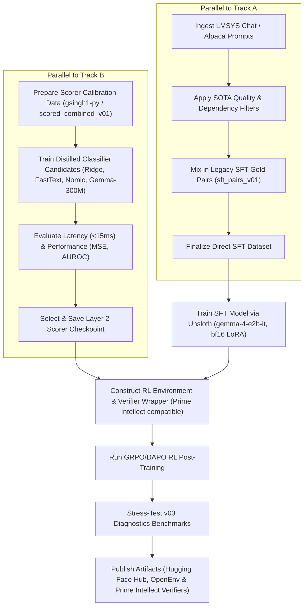

# Alignment Strategy: Fine-Tuning Gemma 4 E2B-it (SFT + RL)

**Date:** 2026-05-23  
**Status:** Proposed Strategy (Direct Generative Humanness + Multi-Model Distillation Scorer)  
**Target Model:** `google/gemma-4-e2b-it` (5.1B total, 2B effective parameters)

---

## 1. The Paradigm Shift: Direct Generative Humanness vs. Rewriting

The goal of this project is to build an instruction-following model that **natively outputs human-sounding text from scratch**, rather than a model that simply "rewrites" or "humanizes" already AI-written text.

### The Two Paradigms:
1.  **De-AIification / Rewriting (Old Plan):** 
    - *Input:* AI-generated text.
    - *Output:* Humanized text.
    - *Problem:* The model only learns how to paraphrase/edit existing text. It doesn't help when prompted directly to draft new content from scratch.
2.  **Direct Generative Humanness (New Plan - Direct Alignment):**
    - *Input:* Standard user instruction (e.g., "Write an email about the blocker", "Explain caching").
    - *Output:* A high-quality response written in a natural human style from the get-go (avoiding hedging, uniform sentence lengths, transition overuse, sycophantic openers/closers, etc.).

---

## 2. Repurposing Existing Datasets

Nothing we have done is wasted. The existing pipeline and dataset components map perfectly to this generative alignment target:

*   **The Seed Data as the Task Pool:** 
    Our curated human seed pool (in [corpus_seeds.jsonl](file:///Users/jshah/Documents/GitHub/humanize-rl/seeds/v03/corpus_seeds.jsonl)) contains matched `(instruction, response)` pairs where the response is verifiably human. The `instruction` is our direct training prompt, and the human `response` is the gold target.
*   **The Matched Humanized Data as a Synthetic Boost:** 
    When we run our humanizer pipeline, we produce high-scoring humanized responses to the seed instructions. We can extract these to create synthetic training pairs mapping `instruction -> humanized_response`. This expands our SFT training pool to thousands of high-quality examples.
*   **The AIified Data as a Classifier Calibrator:** 
    We do **not** show AI-style texts to the model during training. Instead, the AIified texts are used to train and calibrate our Layer 1 and Layer 2 Humanness Scorers—ensuring the reward model can accurately identify and penalize AI-style patterns during reinforcement learning.

---

## 3. Supervised Fine-Tuning (SFT) Data Preparation

For SFT on `gemma-4-e2b-it`, we train the model directly on standard prompt-response pairs, showing it only high-quality, human-style writing.

### 3.1 Dataset Formatting
Using Unsloth's `standardize_sharegpt` utility, SFT data is formatted as direct user-assistant conversational turns:

```json
{
  "messages": [
    {
      "role": "user",
      "content": "{instruction}"
    },
    {
      "role": "assistant",
      "content": "{human_or_humanized_response}"
    }
  ]
}
```

### 3.2 SFT Dataset Sourcing
1.  **Gold SFT Set (20%):** Curated human corpus pairs `(instruction, human_response)` from Enron (emails), GoodWiki (technical explanations), and CNN/DailyMail (journalistic opinion).
2.  **Synthetic Humanness Boost (80%):** Pairs mapping `(instruction, humanized_response)` generated via our Arka selectors and verified by the two-layer scoring gate (passing threshold > 0.75).

---

## 4. Reinforcement Learning (RL) Task & Environment Design

If SFT behavioral cloning is insufficient to eliminate all AI tells, we run RL (using `verifiers` and `Unsloth`'s GRPO framework).

### 4.1 Reference-Free RL Rewards
Relying on a single human-written target response (evaluating generation $y_i$ against a gold reference $x_{\text{ref}}$ via BLEU, ROUGE, or BERTScore) in RL post-training is problematic:
1.  **Reference Bias:** Forcing the model to align with one specific human text penalizes other creative, valid, and high-quality human-sounding answers that use different phrasing, layout, or details.
2.  **The "Alignment Tax" on Generation:** Forcing semantic overlap with a specific reference response limits the model’s exploration space, leading to training instability and degrading its instruction-following capacity.

#### SOTA Solution: KL Regularization over Reference Prompts
In modern post-training (e.g., GRPO/DAPO), we prevent **semantic drift** and enforce general coherence **without** comparing the output to a reference text. 

Instead, we compute a token-level **Kullback-Leibler (KL) Divergence Penalty** relative to the frozen starting SFT model ($\pi_{\text{SFT}}$):

$$\text{Reward}(x, y) = R_{\text{humanness}}(y) - \beta D_{\text{KL}}(\pi_\theta(y \mid x) \parallel \pi_{\text{SFT}}(y \mid x))$$

*   **How it works:** The starting SFT model already knows how to follow instructions and generate fluent text. The KL divergence acts as a regularizer, allowing the policy model ($\pi_\theta$) to change its *writing style* (humanness) while keeping it structurally anchored to its base instruction-following capabilities.
*   **Result:** We remove all semantic reference similarity constraints from the RL loop, lowering latency and removing reference bias completely.

---

## 5. Layer 2 Distilled Classifier: Model Evaluation Matrix

To evaluate Layer 2 rubric scores (which require reading comprehension) without paying OpenRouter API costs or suffering from latency, we train a local surrogate classifier in parallel with our main training pipeline. We evaluate four candidate configurations to choose the most robust, low-latency surrogate:

### 5.1 The Candidate Spectrum

| Model / Baseline Candidate | Type | Dimensions / Pooling | Motive |
| :--- | :--- | :--- | :--- |
| **Baseline 1: TF-IDF + Ridge** | Statistical | N-grams (1 to 4) | Simplest, fastest baseline ($<1$ms). Catches obvious surface keywords but blind to grammar or context. |
| **Baseline 2: FastText** | Word Vectors | Character n-grams | Lightweight classifier ($<1$ms). Captures morphological tells and structural token frequencies. |
| **Candidate A: Nomic Embed v1.5** | Dense Embedding | 768 / Matryoshka (MRL) | Supports truncation to 256/128 dims. Requires prepending prefix (`classification:`) before embedding. |
| **Candidate B: EmbeddingGemma 300M** | Dense Embedding | 768 / Matryoshka (MRL) | Bi-directional Gemma 3 backbone. Aligns representation patterns closely with our target generator (`gemma-4-e2b-it`). |

### 5.2 Classifier Architecture
For our dense candidates (Nomic and EmbeddingGemma), we extract the pooled sequence representation and train two parallel heads:
1.  **Binary Head:** Outputs the probability that the text is AI-generated vs. human-written. Pre-trained on large-scale datasets.
2.  **Rubric Regression Head:** Outputs 8 continuous values $[0, 1]$ corresponding to our Layer 2 rubric criteria (formality gradient, personality presence, copula avoidance, etc.). Trained on the dataset generated from [score_all.py](file:///Users/jshah/Documents/GitHub/humanize-rl/src/humanize_rl/score_all.py).

### 5.3 Classifier Evaluation Metrics
The chosen classifier is selected by measuring performance on `gsingh1-py/train` (58k NYT/GPT-4o/Llama-8B pairs):
*   **Mean Squared Error (MSE) / R-squared ($R^2$):** Accuracy of regression scores relative to Gemini 3.1 Pro scores.
*   **AUROC (Area Under ROC):** Performance on human vs. AI text classification.
*   **Latency (ms):** Target execution speed of **$<15\text{ms}$** on a standard GPU.

---

## 6. SOTA Dataset Ingestion & Filtering

To expand the task pool using massive datasets like `lmsys/lmsys-chat-1m` or `Alpaca-GPT4`, we implement a three-stage filtering pipeline to isolate high-quality writing prompts:

```
[Raw Ingestion: LMSYS Chat / Alpaca]
                 │
                 ▼
[Stage 1: fastText Quality Filter]
Filters out boilerplate, code snippets, and non-English text
                 │
                 ▼
[Stage 2: Token Priors / Perplexity Proxy]
Model-free perplexity estimation using word frequencies
                 │
                 ▼
[Stage 3: Linguistic POS Pattern Matching]
spaCy Verb-to-Object dependency parser (writing-task check)
```

1.  **Stage 1: fastText Quality Classifier:** Removes raw programming code, markdown formatting glitches, non-English prompts, and conversational boilerplate.
2.  **Stage 2: Prior-Based Perplexity Proxy:** Estimates token priors using corpus-level term frequency statistics. Prompts with abnormally high or low prior scores (representing gibberish or repetitive instructions) are discarded.
3.  **Stage 3: spaCy POS Dependency Parser:** A deterministic checker that parses the prompt and verifies if it asks for a writing act. We keep the instruction only if it maps to:
    $$\text{Verb(write, draft, compose, explain, summarize, rewrite)} \rightarrow \text{Object(email, post, essay, summary, update, document)}$$

---

## 7. Target Domain Expansion

We expand our target domains to cover a wider breadth of tasks:

| Domain | Focus | Common AI Tells to Address |
| :--- | :--- | :--- |
| **email / professional** | Status updates, requests, memos. | Overly formal greetings, sycophantic CTAs, transition density. |
| **instruction / technical** | Caching, setups, config guides. | Structural monotony, bullet-point overuse, specificity drops. |
| **blog / opinion / essay** | Reflection, argumentation. | Shallow introductions, motivational tangents, padding. |
| **academic / formal** | Abstracts, methods sections. | Copula avoidance ("serves to show" instead of "shows"), passive voice. |
| **creative / expressive** | Scenes, narratives, reflections. | Cliché vocabulary, uniform sentence lengths, lack of character. |
| **social_media / casual** | LinkedIn updates, short posts. | Overuse of emojis, rule-of-three headers, generic engagement hooks. |

---

## 8. Custom Arka Stage Design: Ingest & Filter Pipeline

To support this filtering in **Arka** without violating the project rules, we design these filters as **reusable Python helpers** and wire them into Arka's config using Arka's built-in **`FilterStage`** parameters.

```yaml
# configs/v03/03-scaleup-filter.yaml
stages:
  # Ingest raw dataset
  - type: DatasetIngestionStage
    source: "lmsys/lmsys-chat-1m"
    split: "train"

  # Filter using our custom python hooks
  - type: FilterStage
    python_filters:
      - "humanize_rl.data.filters.fasttext_quality_filter"
      - "humanize_rl.data.filters.token_prior_perplexity_filter"
      - "humanize_rl.data.filters.spacy_writing_dependency_filter"

  # Classify domain using instruction patterns
  - type: DomainClassifierStage
    mappings:
      email: ["email", "memo", "professional update"]
      technical: ["how-to", "caching", "docker", "setup"]
      blog_opinion: ["opinion", "blog post", "essay"]
      social_media: ["tweet", "linkedin", "social"]
```

---

## 9. Leveraging Legacy Datasets (Slice 1 & 2 Integration)

To preserve all high-quality data engineered during prior project iterations, we integrate the legacy datasets directly into three pipeline modules:

### 9.1 SFT Training Data Mixing
*   **The Data:** The 50 high-quality, manually vetted SFT pairs from [sft_pairs_v01.jsonl](file:///Users/jshah/Documents/GitHub/humanize-rl/data/processed/sft_pairs_v01.jsonl).
*   **The Integration:** These pairs are reformatted to the direct `(instruction, humanized_response)` turn structure and appended to the scaleup dataset. They serve as a high-signal "gold anchor" subset during model training, ensuring the model retains targeted corrections for hand-guided alignment patterns.

### 9.2 Surrogate Classifier Calibration
*   **The Data:** The 150 scored rows in [scored_combined_v01.jsonl](file:///Users/jshah/Documents/GitHub/humanize-rl/data/benchmark/scored_combined_v01.jsonl) containing combined L1 + L2 scores and reasoning strings.
*   **The Integration:** This dataset serves as a specialized evaluation split for training the rubric regression heads of the distilled classifier candidates (Nomic and EmbeddingGemma). It helps verify that the surrogate models capture the nuanced judgments initially made by Gemini 3.1 Pro.

### 9.3 Diagnostic Benchmark Split
*   **The Data:** Curated human seeds in [human_seeds_v01.jsonl](file:///Users/jshah/Documents/GitHub/humanize-rl/seeds/human_seeds_v01.jsonl).
*   **The Integration:** Kept as a core part of the `v03_diagnostics` split (or diagnostic pool) in [report_v03.py](file:///Users/jshah/Documents/GitHub/humanize-rl/src/humanize_rl/data/report_v03.py) to stress-test the model against human-written prose containing challenging natural features (like contractions or em-dashes).

---

## 10. Execution Workflow & Parallelization Chart

To accelerate delivery, the implementation is divided into two parallelizable tracks (Scorer Calibration and SFT Data Preparation) that merge prior to SFT Model Training, with a final pipeline run leading to Reinforcement Learning and deployment:



---

## 11. Publishing & Model Release Lifecycle (Hugging Face, OpenEnv, Prime Intellect)

To support open science, collaboration, and external verification, we will publish the full stack of training outputs to public repositories:

### 11.1 Hugging Face Hub Releases
We will publish the following repositories under the project's namespace:

1.  **Model Repositories:**
    *   `humanize-rl-l2-stylistic-scorer`: The final selected and calibrated distilled Layer 2 classifier candidate (e.g., `EmbeddingGemma 300M` model with custom heads).
    *   `gemma-4-e2b-it-direct-sft`: The base Supervised Fine-Tuned policy model checkpoint.
    *   `gemma-4-e2b-it-humanized`: The final post-RL instruction-following model aligned for direct generative humanness.
2.  **Dataset Repositories:**
    *   `humanize-rl-sft-dataset`: The exact training split containing the filtered prompt-response mix (LMSYS/Alpaca filtered data + legacy gold pairs).
    *   `humanize-rl-scorer-calibration-set`: The raw and Gemini-labeled text calibration rows used to train and calibrate the surrogate scorer.

### 11.2 Prime Intellect Verifiers & OpenEnv Integration
To validate the reinforcement learning phase on decentralized infrastructure:

1.  **Reward Verifier Container:**
    *   We will package our scoring engine (distilled Layer 2 surrogate model + Layer 1 stylistic metrics + entity/number preservation logic) into an execution-safe verifier script.
    *   This verifier is registered to **Prime Intellect Verifiers** and **OpenEnv**, allowing nodes/workers to score policy generations deterministically in a distributed fashion.
2.  **RL Environment Spec:**
    *   We will publish the environment wrapper config specifying the exact reward weights, target metrics, and KL regularization scale parameters so that our RL runs are 100% reproducible on any decentralized training cluster.
