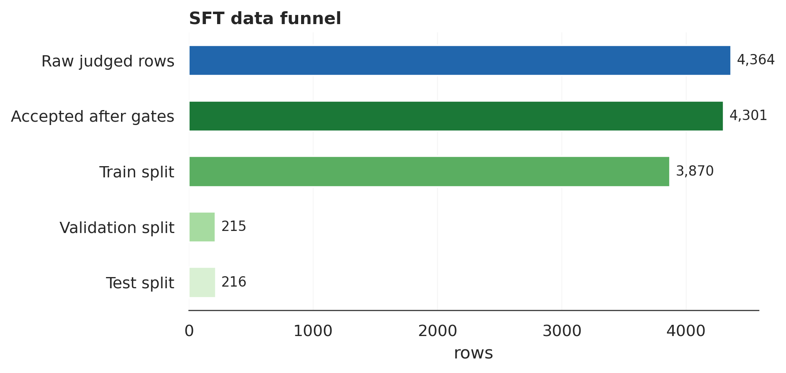
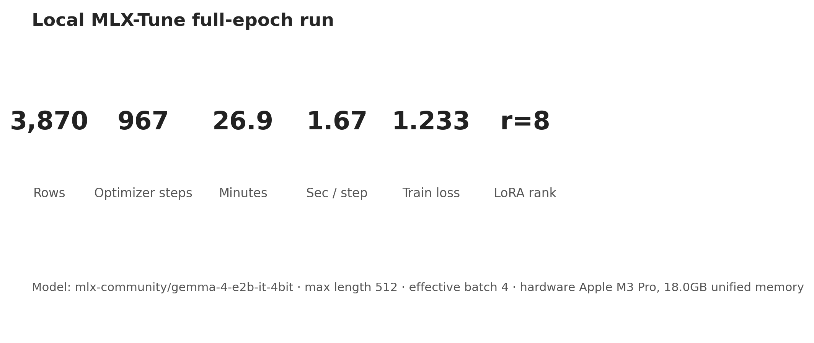
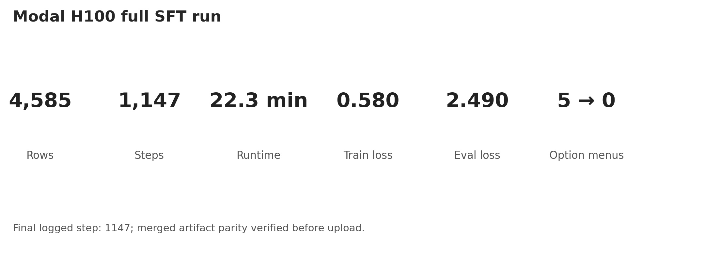
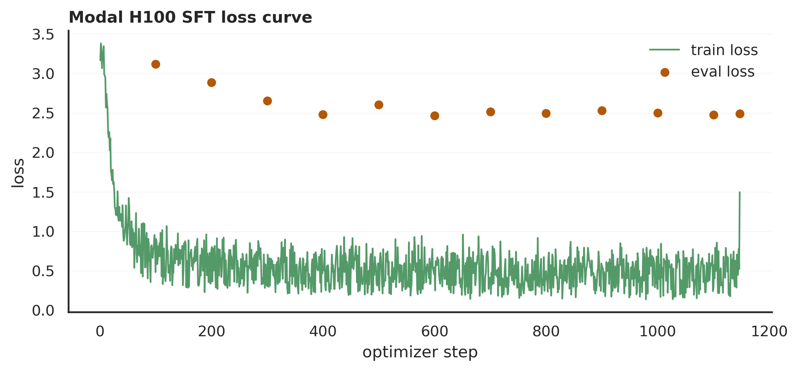
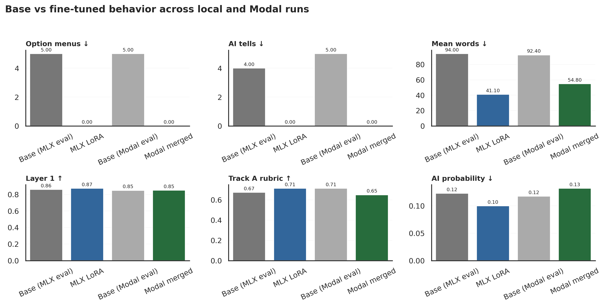

# Gemma 4 E2B-it SFT Vertical Slice Report

**Status:** complete sub-report for later paper integration  
**Date:** 2026-05-24 / 2026-05-25  
**Base model:** Gemma 4 E2B-it  
**Local MLX adapter:** `adapters/gemma4_e2b_v04_mlx_full_r8`  
**Modal LoRA:** `jayshah5696/gemma4-e2b-humanize-unsloth-lora`  
**Verified Modal merged model:** `jayshah5696/gemma4-e2b-humanize-unsloth-merged`  
**Dataset:** `jayshah5696/humanize-rl-sft-dataset` and local filtered SFT splits

## 1. Purpose

This report documents the supervised fine-tuning slice for direct humanness alignment. The goal was not just to build a dataset or scorer, but to verify that the project can train Gemma 4 E2B-it to answer writing tasks with a single usable response in the requested register.

The target failure mode is specific: the base instruction model often answers simple writing requests with option menus, long explanations, subject-line boilerplate, or generic assistant framing. The desired model should simply produce the rewrite, Slack update, email, incident summary, or explanation.

This sub-report is meant to be adapted into the eventual paper. It intentionally separates experimental findings from the main paper narrative.

## 2. Dataset preparation

The initial local source was:

```text
data/processed/v04_sft_final.jsonl
```

It contained 4,364 judged instruction-response rows. A second hard-filter pass converted rows to chat `messages` format and rejected examples with:

- empty or short fields;
- known AI-tell phrases such as `certainly`, `of course`, `it is worth noting`, `furthermore`, and `please don't hesitate`;
- meta-instructions about AI, ChatGPT, detector evasion, or humanization;
- possible phone/email PII;
- likely invented names in rewrite or missing-detail prompts;
- exact duplicates;
- high Track A AI-pattern probability.



Local filtered split:

| split | rows |
|---|---:|
| train | 3,870 |
| validation | 215 |
| test | 216 |
| accepted total | 4,301 |
| rejected | 63 |

For the Modal run, we used the uploaded Hugging Face dataset:

```text
jayshah5696/humanize-rl-sft-dataset
```

This dataset contained 4,835 rows. The Modal script split it into 4,585 training rows and 250 eval rows.

## 3. Track A scorer relationship

The Track A scorer from `paper/track_a_scorer_report.md` was used as a local rubric surrogate. It is a TF-IDF Logistic+Ridge model with:

- binary AI-pattern probability;
- eight continuous rubric-regression outputs.

It is not a final judge. We use it for cheap before/after diagnostics, especially to catch option menus, AI-tell phrases, padding, and stylistic regressions.

## 4. Local MLX run

The local MLX path required using the Gemma 4 VLM route, even for text-only examples. Direct `mlx_lm.lora` failed on Gemma 4 shared-KV loading, and generic text `SFTTrainer` was the wrong route. The working path used:

- `FastVisionModel`;
- `VLMSFTTrainer`;
- `UnslothVisionDataCollator`;
- VLM-style text messages: `[{"type": "text", "text": ...}]`;
- language-layer LoRA only;
- frozen vision/audio towers.

Local run:

| setting | value |
|---|---:|
| model | `mlx-community/gemma-4-e2b-it-4bit` |
| train rows | 3,870 |
| optimizer steps | 967 |
| effective batch size | 4 |
| max sequence length | 512 |
| LoRA rank / alpha | 8 / 8 |
| trainable parameters | 12.67M |
| runtime | 26.9 min |
| final running mean loss | 1.233 |



The local MLX run improved the target behavior but did not capture dense step-level loss. That limitation motivated the Modal reproduction.

## 5. Modal / Unsloth reproduction

We reproduced the run on Modal using Unsloth. Operationally, three lessons mattered:

1. full Modal training must use `modal run --detach`;
2. detached local entrypoints must call `.spawn()`, not `.remote()`;
3. checkpoint resume must be explicit.

The successful full run used a stable W&B run id and checkpointed to a Modal Volume. The final full run was:

```text
gemma4-e2b-modal-full-r8-h100-clean-v1
```

W&B:

```text
https://wandb.ai/jayshah5696/humanize-rl/runs/gemma4-e2b-modal-full-r8-h100-clean-v1
```

Modal run:

| setting | value |
|---|---:|
| backend | Modal + Unsloth |
| GPU | H100 |
| base model | `unsloth/gemma-4-E2B-it` |
| dataset | `jayshah5696/humanize-rl-sft-dataset` |
| train rows | 4,585 |
| eval rows | 250 |
| optimizer steps | 1,147 |
| effective batch size | 4 |
| max sequence length | 512 |
| LoRA rank / alpha | 8 / 8 |
| trainable parameters | 12.67M |
| trainable fraction | 0.25% |
| train runtime | 1,340 sec / 22.3 min |
| final train loss | 0.5804 |
| final eval loss | 2.490 |



Unlike the first local run, W&B captured dense step-level training telemetry.



## 6. Merge and artifact verification

The LoRA upload succeeded first:

```text
https://huggingface.co/jayshah5696/gemma4-e2b-humanize-unsloth-lora
```

The first merged artifact was bad because stale unsharded `model.safetensors` files remained alongside sharded weights and the loader selected the wrong artifact. We fixed this by regenerating a verified merged model and deleting stale files.

The final verified merged model is:

```text
https://huggingface.co/jayshah5696/gemma4-e2b-humanize-unsloth-merged
```

Verification procedure:

1. load base + LoRA;
2. generate on a held-out rewrite prompt;
3. merge in memory with `merge_and_unload()`;
4. verify in-memory merged output equals direct LoRA output;
5. save merged shards;
6. reload saved merged model;
7. verify saved/reloaded output equals direct LoRA output;
8. upload only after parity passes.

The verified parity output was:

> Hi Saurabh, I'm really looking forward to working with you. Please let me know if there's anything specific you'd like me to read or refer to. Ernest mentioned LangGraph, which I've used in a few projects. I'd love to hear your thoughts when you have a moment.

## 7. Evaluation design

We evaluated 10 hand-written prompts covering:

1. professional rewrite;
2. Slack rewrite;
3. client hotfix email;
4. PTO email with placeholder constraints;
5. product release note rewrite;
6. incident summary;
7. candidate rejection email;
8. technical explanation;
9. founder/investor update rewrite;
10. peer PR-review ping.

Each response was scored with:

- Layer 1 deterministic heuristics;
- Track A distilled AI-probability;
- Track A distilled rubric mean;
- word count;
- option-menu count;
- known AI-tell count.

## 8. Results

The strongest and most reliable improvement is behavioral: option-menu responses disappear.



### Local MLX evaluation

| metric | base | MLX LoRA |
|---|---:|---:|
| Layer 1 mean | 0.860 | 0.874 |
| Track A AI probability | 0.123 | 0.100 |
| Track A rubric mean | 0.674 | 0.714 |
| option-menu outputs | 5 | 0 |
| known AI-tell phrases | 4 | 0 |
| mean word count | 94.0 | 41.1 |

### Modal verified merged evaluation

| metric | base | verified merged |
|---|---:|---:|
| Layer 1 mean | 0.849 | 0.850 |
| Track A AI probability | 0.117 | 0.132 |
| Track A rubric mean | 0.714 | 0.650 |
| option-menu outputs | 5 | 0 |
| known AI-tell phrases | 5 | 0 |
| mean word count | 92.4 | 54.8 |

The Track A rubric mean falls for the Modal merged model, even though the visible behavior improves. This is an important limitation of the scorer: the local rubric surrogate rewards some verbose structured answers, while our target behavior intentionally removes option menus and shortens responses. The behavioral metrics better reflect the objective for this slice.

## 9. Representative examples

### Professional rewrite

**Prompt**

> Rewrite this message so it sounds natural, warm, and professional. Keep it concise and preserve all facts.  
> Hi Saurabh. Yes looking forward to working with you. Let me know if you want any specific things to read or refer. Ernest mentioned about LangGraph which I have already used in few projects. Love to hear from you.

**Base**

> Here are a few options, depending on the exact tone you want to strike:  
> **Option 1: Warm and Enthusiastic...**

**Verified merged**

> Hi Saurabh, I'm really looking forward to working with you. Please let me know if there's anything specific you'd like me to read or refer to. Ernest mentioned LangGraph, which I've used in a few projects. I'd love to hear your thoughts when you have a moment.

### Slack staging update

**Prompt**

> Clean up this Slack update. Make it casual, direct, and not overly polished.  
> Please be advised that the staging environment has been restored to full operational status. The root cause was identified as a missing environment variable, and we will continue monitoring performance parameters throughout the afternoon.

**Base**

> Here are a few options, depending on how casual you want to be:  
> **Option 1: Quick & Direct** ...

**Verified merged**

> Hey everyone, staging is back up and running! It was just a missing environment variable. We're keeping an eye on things.

## 10. Limitations

- The eval set has only 10 prompts.
- Track A is a local surrogate and not a final human preference judge.
- Modal H100 was underutilized because we kept the conservative batch size from local/L40S runs.
- Some outputs remain too email-formal, with subject lines and sign-offs.
- Candidate rejection still needs perspective-specific evaluation.
- The merged artifact required explicit parity verification; naive upload was not enough.

## 11. Next steps

1. Expand to 50--100 held-out prompts.
2. Add manual labels for instruction following, unsupported details, concision, and perspective correctness.
3. Run a batch-size-optimized Modal run (`batch_size=4`, `grad_accum=4`) if more SFT is needed.
4. Patch data for candidate rejection, unnecessary placeholders, and email over-formatting.
5. Use the verified merged model as the base for downstream preference/RL experiments.

## 12. Reproducibility artifacts

Scripts:

```text
scripts/build_gemma4_sft_dataset.py
scripts/train_mlx_gemma4_local.py
src/humanize_rl/training/finetune_gemma4_modal.py
src/humanize_rl/training/merge_verify_push_gemma4_modal.py
src/humanize_rl/training/evaluate_gemma4_modal.py
scripts/create_modal_sft_report_figures.py
```

Outputs:

```text
outputs_gemma4_humanize_mlx_full_r8/eval_v01/
outputs_gemma4_humanize_modal_verified_eval/
paper/figures/sft/
```
