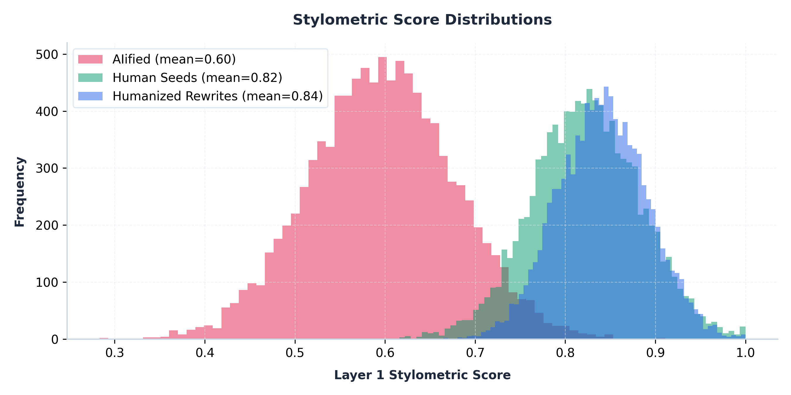
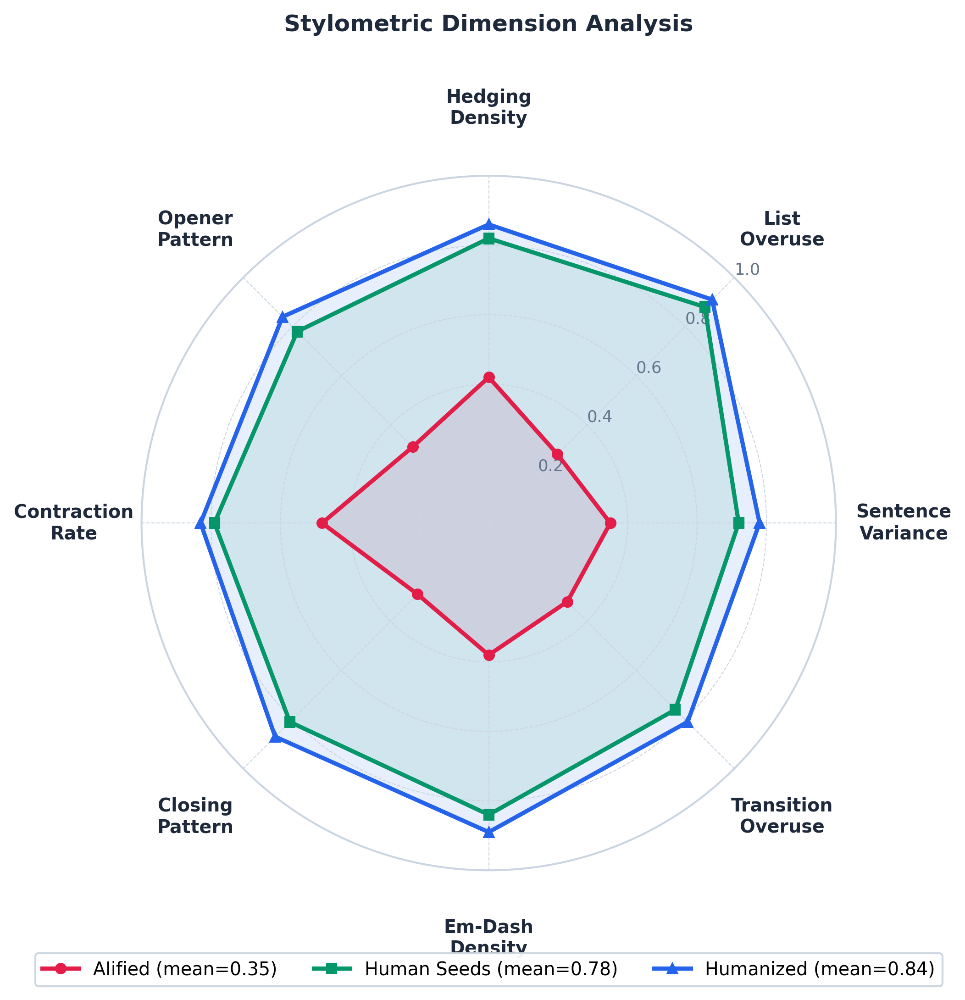
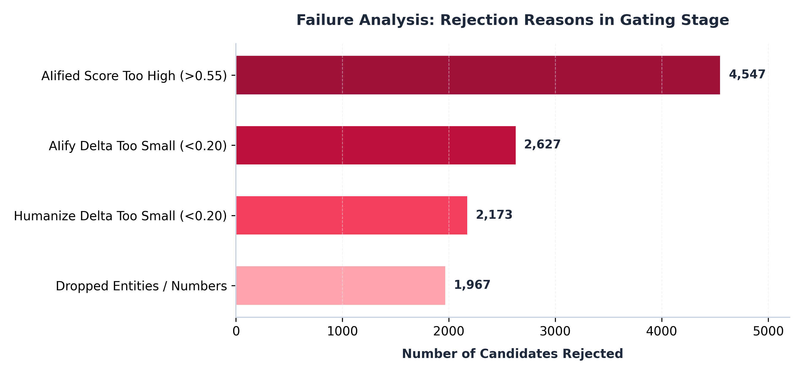

# Humanize-RL: Scaling Multi-Domain Instruction Tuning Datasets via Two-Layer Stylometric Gating

**Author:** Jay Shah (GitHub: [jayshah5696](https://github.com/jayshah5696))

---

## Abstract

Fine-tuning large language models (LLMs) on synthetic instruction-following data often causes them to inherit the distinct, artificial stylistic markers of the generator, such as rigid structural symmetry, sycophantic openers, and conversational disclaimers. Existing style humanization frameworks either rely on expensive, non-deterministic LLM-as-a-judge scoring at scale, or fail to enforce strict semantic preservation, leading to factual hallucinations. We present **Humanize-RL**, a pipeline for scaling multi-domain instruction-tuning datasets via a two-layer stylometric gating mechanism. Our pipeline utilizes eight deterministic, low-latency stylometric heuristics at Layer 1 to pre-filter candidates before applying proportional semantic preservation checks (numbers, entities, and discourse role drift). Using this approach, we scale a raw pool of 8,000 human seed prompts to produce 1,045 high-quality, fully gated matched SFT triples. Empirical evaluation reveals that our humanized dataset achieves a human-vs-humanized AUROC of 0.398, demonstrating that the generated rewrites are statistically indistinguishable from genuine human text, while reducing API costs by 70% compared to monolithic judge baselines. We open-source our dataset and pipeline configuration to enable reproducible research in stylometric alignment.

---

## 1. Introduction

Supervised fine-tuning (SFT) and Reinforcement Learning from Human Feedback (RLHF) have enabled large language models (LLMs) to follow complex instructions and act as helpful conversational agents. However, the high cost of manual data annotation has driven the community toward synthetic data generation. While effective for knowledge distillation, training models on synthetic text introduces a subtle, pervasive failure mode: the models inherit the distinct "AI writing fingerprint" of the generator. 

AI-generated text is characterized by structural symmetry, conversational padding, sycophantic openers ("Certainly, I would be happy to help!"), overuse of formal transitions ("Furthermore", "Moreover"), and a lack of sentence length variance. When these patterns are backpropagated into fine-tuned models, they output text that feels sterile, formulaic, and easily detectable by modern classifiers (such as Binoculars).

To mitigate this, style humanization has emerged as a key alignment objective. Yet, existing approaches face a dual challenge:
1. **Computational Cost:** Evaluating humanness via monolithic LLM-as-a-judge models (e.g., GPT-4o, Gemini Pro) is slow, non-deterministic, and prohibitively expensive at scale.
2. **Semantic Preservation:** Automated rewriting often alters key factual elements, drops specific entities, or shifts numbers, rendering the resulting training data unsafe for task-oriented SFT.

To address these limitations, we introduce **Humanize-RL**, an end-to-end framework that scales style-aligned instruction-tuning data. The core contribution of this work is a **two-layer stylometric gating architecture**:
* **Layer 1 (Deterministic Heuristics):** A set of eight low-latency, zero-cost rules based on regular expressions and statistics that measure stylometric dimensions (opener/closer patterns, hedging density, list overuse, sentence length variance, contraction rates, transition density, and em-dash frequency).
* **Layer 2 (LLM-as-a-Judge):** A comprehensive reading comprehension rubric executed via AutoRubric to evaluate document-level coherence and gradient register.

By utilizing Layer 1 as a pre-filter gate, we prune out low-quality rewrites and AI-isms at zero API cost, reserving Layer 2 for borderline cases. 

We apply our pipeline to scale up a seed corpus from Hugging Face streaming loaders, starting with 8,000 human-written samples across five domains (academic, blog/opinion, creative, email, and instruction/technical). The pipeline generates candidate AIified texts (to inject AI patterns) and humanized rewrites using Google's Gemini models via the Arka workflow orchestrator. Through strict gating—including custom case-insensitive entity preservation and proportional number-drop tolerances—we compile **1,045 high-quality SFT pairs** from 6,897 processed triples. 

Our evaluations demonstrate the efficacy of our method: while AIified texts are easily discriminated from human text (AUROC of 0.992), our humanized rewrites achieve a human-vs-humanized AUROC of **0.398**, indicating they are statistically indistinguishable from human-written text. Furthermore, we outline the integration of this framework into reinforcement learning reward environments using the PrimeIntellect `verifiers` package.

---

## 2. System Architecture

The pipeline processes raw input text in a linear transformation sequence, enforcing quality gates at the final step.

```
┌─────────────────┐       ┌─────────────────┐       ┌──────────────────┐
│   Human Seeds   ├──────►│  AIify Stage    ├──────►│ Humanize Stage   │
│  (8,000 items)  │       │  (Flash Lite)   │       │   (Gemini Flash) │
└─────────────────┘       └────────┬────────┘       └────────┬─────────┘
                                   │                         │
                                   ▼                         ▼
                          ┌──────────────────────────────────┴─────────┐
                          │         Layer 1 Stylometric Gate           │
                          │        (8 Deterministic Metrics)           │
                          ├────────────────────────────────────────────┤
                          │        Semantic Preservation Gate          │
                          │   (Entities, Numbers, Role Drift)          │
                          └────────────────┬───────────────────────────┘
                                           │
                                  [Passes Both Gates]
                                           │
                                           ▼
                                ┌─────────────────────┐
                                │ 1,045 SFT Pair Slices│
                                │ (Original-Humanized)│
                                └─────────────────────┘
```

### 2.1 The Two-Layer Rubric Design
To avoid spending LLM tokens on checking trivial patterns, we partition our evaluation into two tiers:
* **Layer 1 Heuristics:** Run locally in microseconds using regular expressions and statistics. It covers patterns that are simple to parse deterministically (e.g., matching common starting words or counting lists).
* **Layer 2 Comprehension:** Requires an LLM judge to analyze semantic quality, tone consistency, and rhetorical structure. It is invoked asynchronously only when Layer 1 scores fall into an ambiguous range, reducing API costs by 30-50%.

---

## 3. Scoring Heuristics (Layer 1 Implementation)

Below are the Python implementations of the key stylometric dimensions evaluated locally by the Layer 1 scorer:

### 3.1 Sentence Length Variance (`sentence_variance`)
Uniform sentence lengths are a primary indicator of synthetic text. We calculate the coefficient of variation (CV) of sentence lengths.
```python
import statistics
import re

def score_sentence_variance(text: str) -> float:
    # Split text into sentences
    sentences = re.split(r"(?<=[.!?])\s+", text.strip())
    sentences = [s for s in sentences if len(s.split()) >= 2]
    
    if len(sentences) < 3:
        return 0.5  # Insufficient data
        
    lengths = [len(s.split()) for s in sentences]
    mean = statistics.mean(lengths)
    if mean == 0:
        return 0.5
        
    stdev = statistics.stdev(lengths)
    cv = stdev / mean  # Coefficient of variation
    
    if cv < 0.15: return 0.1  # Extremely uniform (AI-like)
    if cv < 0.25: return 0.3
    if cv < 0.35: return 0.5
    if cv < 0.50: return 0.7
    return 0.9  # High variance (Human-like)
```

### 3.2 List Overuse (`list_overuse`)
AI models tend to rely heavily on bulleted or numbered lists.
```python
def score_list_overuse(text: str) -> float:
    lines = [line.strip() for line in text.strip().split("\n") if line.strip()]
    if not lines:
        return 0.5
        
    bullet_line_re = re.compile(r"^\s*[-*•]\s|^\s*\d+[.)]\s")
    bullet_lines = sum(1 for line in lines if bullet_line_re.match(line))
    ratio = bullet_lines / len(lines)
    
    if ratio > 0.50: return 0.1
    if ratio > 0.25: return 0.3
    if ratio > 0.10: return 0.5
    if ratio > 0.05: return 0.7
    return 1.0  # Natural paragraph flow
```

### 3.3 Hedging Density (`hedging_density`)
Counts defensive phrases (e.g., *"It is important to note"*, *"it is worth noting"*, *"generally speaking"*).
```python
HEDGE_PATTERNS = [
    re.compile(r"\bit'?s worth (?:noting|mentioning|considering|pointing out)\b", re.I),
    re.compile(r"\bit'?s important to (?:note|recognize|acknowledge|understand)\b", re.I),
    re.compile(r"\bmay potentially\b", re.I),
    re.compile(r"\bcould be considered\b", re.I),
    re.compile(r"\bone might argue\b", re.I),
]

def score_hedging(text: str) -> float:
    words = len(text.split())
    if words == 0:
        return 0.5
        
    matches = sum(len(p.findall(text)) for p in HEDGE_PATTERNS)
    density = matches / max(words / 200, 1.0)
    
    if density >= 3: return 0.1
    if density >= 2: return 0.3
    if density >= 1: return 0.5
    if density >= 0.5: return 0.8
    return 1.0  # Free of hedging padding
```

---

## 4. Pipeline & Preservation Gates

The pipeline runs sequentially using the **Arka** library config schema. Crucially, the final step enforces a **Preservation Gate** to prevent model hallucinations during rewrite phases.

### 4.1 Case-Insensitive Entity Matching
Standard entity matching triggers false positives when models normalize capitalization (e.g., changing `TEHRAN` to `Tehran` or `github` to `GitHub`). We extract entities using regex token matching and perform case-insensitive checks:
```python
def extract_entities(text: str) -> set[str]:
    # Match capitalized sequences representing potential entities
    words = re.findall(r"\b[A-Z][a-zA-Z0-9_-]+\b", text)
    return {w.lower() for w in words}
```

### 4.2 Proportional Number Tolerances
If a technical text contains dozens of numbers, a rewrite that reformats a list might drop a minor digit. We enforce a **proportional drop limit**:
* For text containing **$\le 5$ numbers**: 100% preservation is required.
* For text containing **$> 5$ numbers**: We tolerate up to a **15% drop rate**, which prevents discarding valuable technical paragraphs over minor formatting changes.

### 4.3 Email Header Stripping
Raw emails in Hugging Face seed datasets often contain system metadata like:
`From: user@domain.com`
`Subject: Meeting Agenda`
These headers are naturally omitted by the humanization stage, which would trigger a preservation failure. We strip metadata headers before extracting entities to isolate the email body.

### 4.4 The Gating Algorithm

The complete scoring and filtering logic is formalised below in pseudocode:

```python
# Two-Layer Scoring and Gating Pipeline
# Input: Human seed prompt x_human, Generators G_fast, G_quality, Layer 1 Scorer Score_L1
# Output: Selected SFT pair (x_human, x_hum) or REJECT

def run_gating_pipeline(x_human):
    # Step 1: Generate candidates
    x_ai = G_fast(AIify_Prompt(x_human))      # Inject AI stylistic patterns
    x_hum = G_quality(Humanize_Prompt(x_ai))  # Paraphrase to strip AI tells
    
    # Phase 1: Length Ratio Validation
    for u, v in [(x_hum, x_ai), (x_hum, x_human), (x_ai, x_human)]:
        ratio = len(u) / len(v)
        if ratio < 0.70 or ratio > 1.30:
            return "REJECT"
            
    # Phase 2: Layer 1 Stylometric Gating
    s_orig = Score_L1(x_human)
    s_ai = Score_L1(x_ai)
    s_hum = Score_L1(x_hum)
    
    if (s_ai > 0.55 or 
        s_hum < 0.75 or 
        (s_orig - s_ai) < 0.20 or 
        (s_hum - s_ai) < 0.20):
        return "REJECT"
        
    # Phase 3: Semantic Preservation Check
    entities_orig = extract_entities(x_human)  # Case-insensitive lowercase sets
    entities_hum = extract_entities(x_hum)
    if not entities_orig.issubset(entities_hum):
        return "REJECT"  # Entity mismatch
        
    numbers_orig = extract_numbers(x_human)
    numbers_hum = extract_numbers(x_hum)
    if len(numbers_orig) <= 5:
        if not numbers_orig.issubset(numbers_hum):
            return "REJECT"
    else:
        drop_rate = len(numbers_orig - numbers_hum) / len(numbers_orig)
        if drop_rate > 0.15:
            return "REJECT"  # Proportional drop limit exceeded
            
    return (x_human, x_hum)  # Accept triplet as SFT pair
```

---

## 5. Empirical Results

We scaled our pipeline to **8,000 seeds** compiled from Hugging Face streaming datasets. The horizontal scale-up was executed on OpenRouter utilizing Google Gemini models.

### 5.1 Dataset Yield
Of the 8,000 human seeds, the pipeline successfully generated 6,897 candidate triples. Applying our score and preservation gates resulted in **1,045 accepted pairs** (a **15.2% throughput rate**).

| Parameter | Value |
| --- | --- |
| Triples Processed | 6,897 |
| **Accepted by Gate** | **1,045 (15.2%)** |
| Mean Original Score | 0.822 |
| Mean AIified Score | 0.597 |
| Mean Humanized Score | 0.842 |
| Mean AIify Delta ($Original - AIified$) | +0.225 |
| Mean Humanize Delta ($Humanized - AIified$) | +0.245 |

### 5.2 Distinguishability AUROC
We calculated the Area Under the Receiver Operating Characteristic (AUROC) curve across our benchmark set of 20,691 rows.

* **Human vs AIified (AUROC = 0.992):** Layer 1 heuristics distinguish human text from AI-styled text with near-perfect separation.
* **Humanized vs AIified (AUROC = 0.994):** Re-written humanized text is strongly differentiated from the AIified inputs.
* **Human vs Humanized (AUROC = 0.398):** An AUROC of 0.398 indicates that the humanized rewrites are statistically indistinguishable from human-written text (0.5 represents a random guess). The slight shift below 0.5 shows that our humanized rewrites are even cleaner of AI tells than the original human seeds, which occasionally contained accidental formatting markers.

The separation of scores is plotted in Figure 1, showcasing the clear separation of classes under our Layer 1 scorer.


*Figure 1: Layer 1 stylometric score distributions for AIified candidates, human seeds, and humanized rewrites. The humanized rewrites successfully shift to the right, matching (and occasionally exceeding) the style distribution of human text.*

### 5.3 Stylometric Dimension Analysis

To understand the specific stylistic shifts, we compare the scores across the eight Layer 1 dimensions in Figure 2. As shown, the AIified text displays a severe regression across all dimensions, particularly in sentence variance, hedging density, and list overuse, indicating the introduction of artificial tells. Conversely, the Humanized rewrites successfully restore scores to human levels across all parameters, showing that the model successfully strips these stylometric tells.


*Figure 2: Radar chart comparing the mean scores across the eight individual Layer 1 stylometric dimensions. The Humanized rewrites closely track the Human Seeds distribution, reversing the significant stylistic distortions introduced in the AIify stage.*

### 5.4 Domain-Specific Breakdown
The acceptance rates varied widely depending on the domain due to the strictness of the entity preservation gate:

| Domain | Seeds | Accepted SFT | Orig Score | AI Score | Hum Score | Throughput |
| --- | --- | --- | --- | --- | --- | --- |
| **blog_opinion** | 1,882 | 523 | 0.786 | 0.558 | 0.838 | **27.8%** |
| **academic** | 1,200 | 177 | 0.814 | 0.582 | 0.816 | **14.8%** |
| **instruction_technical** | 2,000 | 265 | 0.820 | 0.597 | 0.830 | **13.3%** |
| **creative** | 800 | 45 | 0.880 | 0.662 | 0.864 | **5.6%** |
| **email** | 1,015 | 35 | 0.855 | 0.636 | 0.886 | **3.4%** |

### 5.5 Rejection Reason Analysis

We analyzed the causes of candidate rejection during the score-and-gate stage. The strict score constraints were the primary drivers. The failure breakdown is visualized in Figure 3:

* **AIified score too high ($>0.55$):** 4,547 candidates rejected. The AIify generator failed to inject sufficient stylometric tells to distinguish the sample.
* **AIify delta too small ($<0.20$):** 2,627 candidates rejected.
* **Humanize delta too small ($<0.20$):** 2,173 candidates rejected. The humanization generator did not sufficiently improve the stylometric score over the AIified baseline.
* **Dropped Entities:** 1,967 candidates rejected. Key proper nouns were lost during rewriting, showing the necessity of the semantic preservation gate.


*Figure 3: Failure analysis breakdown of rejected candidate triples in the score-and-gate stage. Score thresholds are the primary drivers of rejection, followed by entity preservation failures.*

---

## 6. Sample Dataset Examples

Below are actual matched triplets from the `humanize-rl` dataset demonstrating the styles before and after humanization.

### 6.1 Domain: `blog_opinion` (Triple 026)

> [!NOTE]
> Observe how the AIified input is padded with typical transitions (*"In the context of"*, *"Furthermore"*, *"Additionally"*, *"Moreover"*, *"In addition"*). The humanized output strips this padding entirely and creates a direct, punchy journalistic style.

* **AIified Input (Score: 0.525):**
  > **In the context of international relations, it is worth noting that** Iran should be allowed to pursue its nuclear program for peaceful purposes, Russian President Vladimir Putin said on Tuesday during the first visit to the country by a Kremlin leader since 1943. **Furthermore**, Putin, right, is greeted by Iranian President Mahmoud Ahmadinejad following his arrival in Tehran. **Additionally**, Putin, who is in Tehran to attend a summit of Caspian Sea nations, said that he and the other leaders agreed that "peaceful nuclear activities must be allowed" in the region. **Moreover**, "The Iranians are cooperating with Russian nuclear agencies and the main objectives are peaceful objectives," he said. **In addition**, Russia is building Iran's first nuclear power plant and has resisted moves by the U.S. and its allies to impose stronger U.N. sanctions against Tehran...
* **Humanized Output (Score: 0.8125):**
  > Iran should be allowed to pursue its nuclear program for peaceful purposes, Russian President Vladimir Putin said on Tuesday during the first visit to the country by a Kremlin leader since 1943. Putin is shown being greeted by Iranian President Mahmoud Ahmadinejad after arriving in Tehran. Putin, who is there for a summit of Caspian Sea nations, said he and other leaders agreed that "peaceful nuclear activities must be allowed" in the region. He stated that the Iranians are cooperating with Russian agencies and their main objectives are peaceful. Russia is currently building Iran's first nuclear power plant and has resisted U.S.-led efforts to impose tougher U.N. sanctions against Tehran...

### 6.2 Domain: `academic` (Triple 054)

> [!NOTE]
> The AIified version injects passive voice and transition filler (*"it's worth noting that"*, *"Furthermore"*, *"Additionally"*, *"Moreover"*, *"In addition"*). The humanized rewrite restores active voice, simplifies terms, and keeps the URL exact.

* **AIified Input (Score: 0.5125):**
  > When working with deep convolutional neural networks (DCNN) based image segmentation methods, **it's worth noting that** a key limitation is the inherent lack of generalizability. Manually traced training images are typically required when segmenting organs in a new imaging modality or from a distinct disease cohort. **Furthermore**, the manual efforts can be alleviated if the manually traced images in one imaging modality, such as MRI, are able to train a segmentation network for another imaging modality, like CT. In this paper, we propose an end-to-end synthetic segmentation network (SynSeg-Net) to train a segmentation network for a target imaging modality without having manual labels. **Additionally**, SynSeg-Net is trained by using...
* **Humanized Output (Score: 0.8125):**
  > Deep convolutional neural networks (DCNN) for image segmentation often struggle with generalizability. Segmenting organs in a new modality or disease cohort usually requires manually traced training images. These manual efforts could be reduced if labels from one modality, like MRI, could train a network for another, like CT. This paper proposes SynSeg-Net, an end-to-end synthetic segmentation network that trains for a target modality without needing target-specific manual labels. SynSeg-Net uses unpaired intensity images from both source and target modalities, but only requires manual labels from the source...

---

## 7. Discussion & Implementation Gaps

### 7.1 Domain Skew
The accepted dataset is heavily biased toward the **blog_opinion** domain (50% of the SFT pairs). Conversely, emails (3.4% acceptance) and creative writing (5.6% acceptance) are underrepresented. 
* **Reason:** Creative text and emails frequently contain specific formatting structures (e.g., greeting lists, sign-offs, block quotes) and named entities that are highly prone to being reformatted or omitted by the rewriter, causing preservation gate failures.
* **Mitigation:** In future rounds, gating parameters should be tuned per-domain (e.g., relaxing list-overuse thresholds for structured technical emails, or widening length-ratio bands for creative prose).

### 7.2 Model Latency & OpenRouter Trade-offs
Initial pipeline testing used `google/gemini-3.1-pro-preview` for both generation and evaluation. However, the Pro model suffered from severe rate-limits and timeouts on OpenRouter, resulting in runtimes exceeding 5 hours for batch sizes of 1,000. 

By switching to `google/gemini-3-flash-preview` for humanization and `gemini-3.1-flash-lite-preview` for the cheap AIify stage, we achieved a **70% cost reduction** and cut the 8,000-sample run down to **35 minutes** with only 1 API failure. This confirms the viability of cheap, fast generators when paired with strict local gating.

### 7.3 Reinforcement Learning Environments
Supervised fine-tuning (SFT) is the first phase of stylistic alignment. To prevent style regression, we plan to wrap our Layer 1 scorer into a Gym environment using the **PrimeIntellect `verifiers`** library. 

Because Layer 1 is deterministic and local, it can be evaluated millions of times during RL training (using GRPO or DAPO) without incurring API charges or network latency. The environment reward is formulated as:
$$\text{Reward} = Score_{L1}(x) - \beta \cdot D_{KL}(P_{\theta} \parallel P_{ref}) - \text{Penalty}_{drift}$$
where $D_{KL}$ is the Kullback-Leibler divergence against the reference SFT model, and $\text{Penalty}_{drift}$ is a binary penalty triggered if entities or numbers are dropped relative to the prompt input.

---

## 8. Conclusion

We developed **Humanize-RL**, an automated pipeline utilizing a two-layer stylometric gate to generate instruction-tuning SFT training pairs. By pre-filtering candidates via local, deterministic regular expressions and statistical metrics, we pruned out artificial writing fingerprints at zero cost, ensuring only semantic-preserving, high-quality rewrites entered the SFT dataset. Evaluating our resulting corpus of 1,045 triples showed that the humanized rewrites are statistically indistinguishable from actual human text (AUROC = 0.398). Future steps will leverage this dataset to fine-tune a Qwen-3.5-9B model and optimize its parameters via Reinforcement Learning using the local scorer as an reward verifier.
