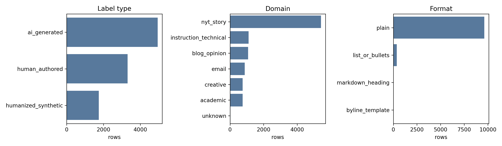
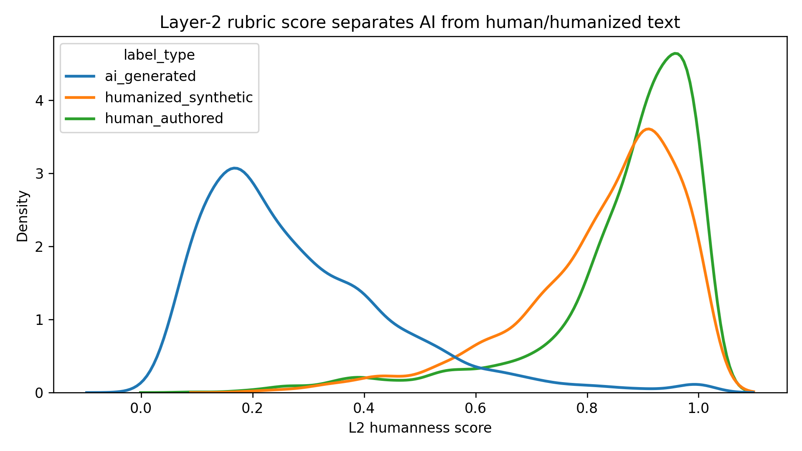
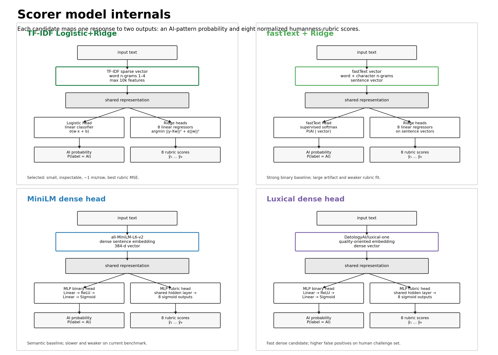
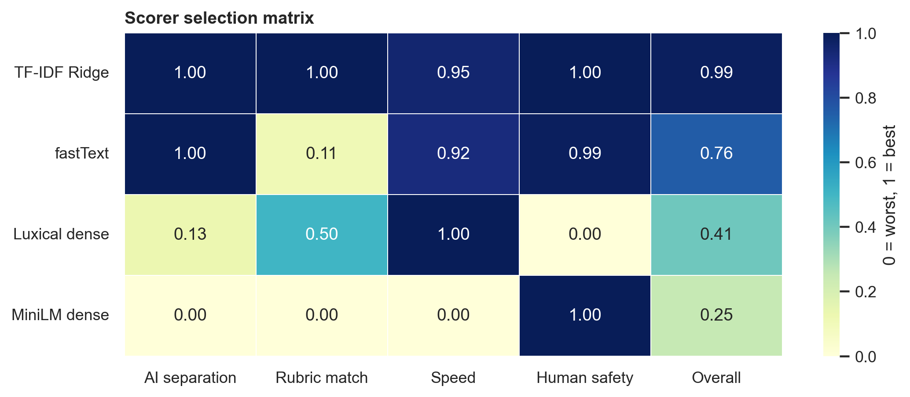
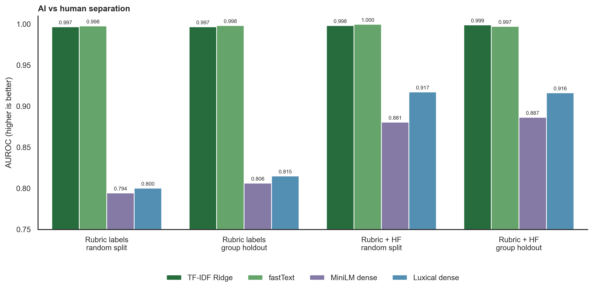
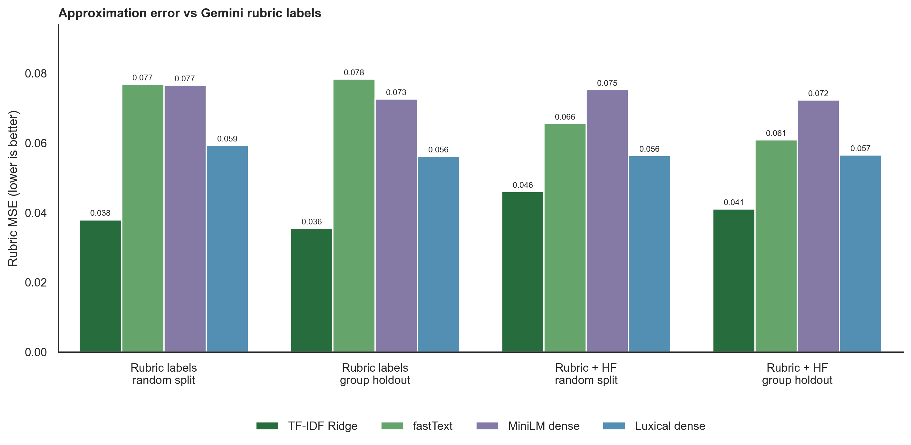
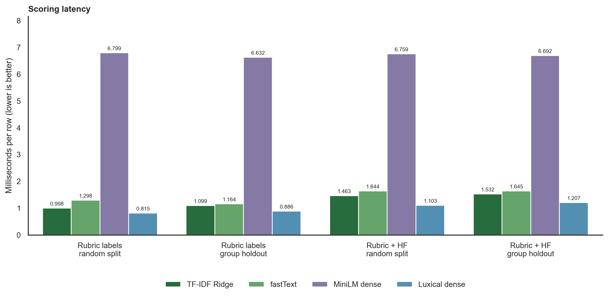
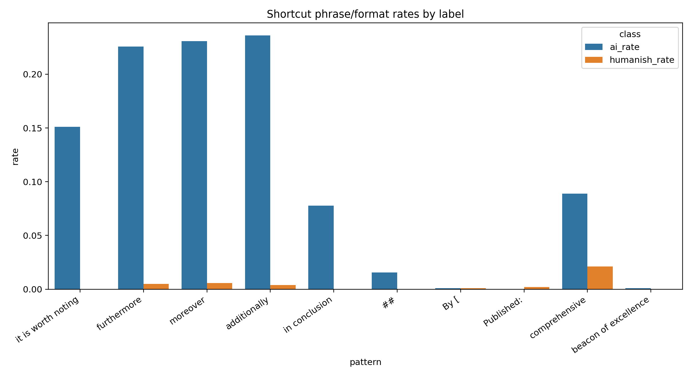
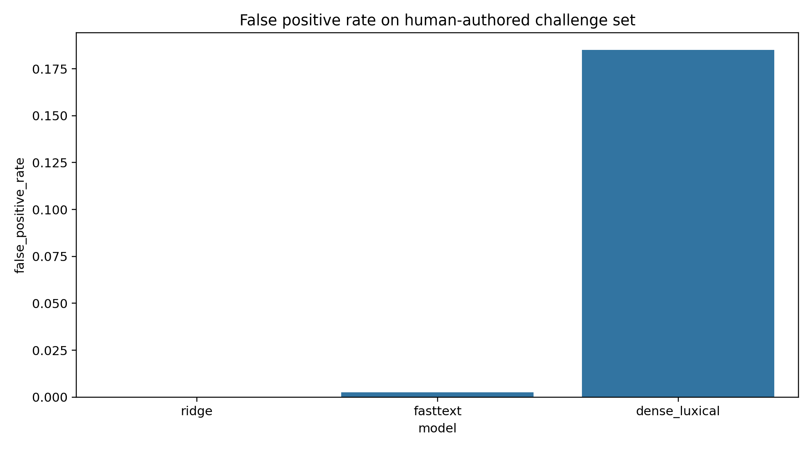

# Distilling a Local Humanness Scorer from LLM Rubric Labels

## 1. Problem

The data pipeline needs to score thousands of candidate responses for human-like writing quality. A frontier LLM judge can do this well, but it is too slow and expensive to call everywhere: dataset filtering, diagnostics, ablations, and future reward loops all need a fast local scorer.

We therefore distill the project’s LLM rubric judge into local models. The local scorer is not intended to be a universal authorship detector. It is a project-specific surrogate for our humanness rubric: it estimates whether a response contains the writing patterns we want to remove and whether it matches the higher-level qualities that the rubric rewards.

## 2. Scoring target

The judge rubric has eight dimensions:

| dimension | what it penalizes |
|---|---|
| structural symmetry | rigid intro/body/conclusion templates, formulaic lists |
| specificity | vague claims without names, numbers, examples, or concrete context |
| formality gradient | unnatural shifts between corporate, academic, and casual tone |
| voice consistency | generic assistant voice instead of a specific writer |
| rhetorical sophistication | filler analysis, stakes inflation, shallow reasoning |
| padding density | repeated restatements and sentences that add no information |
| personality presence | lack of opinion, perspective, humor, friction, or lived detail |
| copula avoidance | pompous substitutes for simple `is/are/was` constructions |

Each dimension is scored on a 1-5 scale by the LLM judge and normalized to `[0, 1]`. The local scorer learns both a binary AI-pattern probability and an eight-dimensional rubric vector.

## 3. Labeled calibration dataset

We built a 10,000-row calibration dataset:

```text
data/scorer/l2_labeled_scorer_v02_10k.jsonl
```

Each row contains raw text, label type, source, domain, format bucket, Layer 1 scores, Layer 2 rubric scores, raw judge scores, and judge reasoning.

| label type | rows | mean LLM-rubric score |
|---|---:|---:|
| AI-generated | 4,946 | 0.283 |
| human-authored | 3,308 | 0.866 |
| humanized synthetic | 1,746 | 0.828 |

Eight rows had an empty per-dimension rubric payload because the judge response failed schema extraction. They remain in the binary-label dataset, but rubric-loss training and rubric-MSE evaluation ignore rows without complete per-dimension scores.

The label distribution is intentionally mixed. We do not only compare human vs AI. We also include humanized synthetic rows because those are the actual target outputs of the pipeline.

| domain | rows |
|---|---:|
| article / story | 5,414 |
| instruction / technical | 1,103 |
| blog / opinion | 1,078 |
| email | 878 |
| creative | 751 |
| academic | 749 |
| unknown | 27 |

The dataset is mostly plain prose and 54% article/story. This is acceptable for scorer calibration, but email/chat behavior still needs domain-specific validation before the scorer gates the v2 SFT dataset.





## 4. How the data was produced

The scorer dataset was assembled from the project’s human, AIified, and humanized text pools plus additional benchmark rows. We used the same humanness rubric used elsewhere in the pipeline, then labeled each example with Gemini. The labeling scripts are resumable and duplicate-safe:

```text
scripts/build_l2_labeling_pool.py
scripts/label_l2_pool.py
scripts/dedupe_l2_labels.py
scripts/merge_l2_labels_into_scorer_data.py
```

During the run we found a real bottleneck: the earlier batch scorer accepted a `max_workers` argument but still scored sequentially. We fixed the labeler by adding concurrent calls with `ThreadPoolExecutor`. After that change, the 10,000-row labeling run completed cleanly.

The final verification was:

```text
10,000 rows
10,000 unique IDs
0 duplicates
8 rows with empty per-dimension scores
```

Rows with empty per-dimension scores are excluded from rubric-regression loss and rubric-MSE evaluation, but retained for binary AI-vs-human-ish training.

## 5. Model architecture

The final scorer is a small multi-head model, not a generative model. The figure below defines the model internals in the same style as an LLM architecture diagram: input text is featurized, then split into a binary AI-pattern head and eight rubric-regression heads.



The selected model is more precisely **TF-IDF Logistic+Ridge**. It uses TF-IDF n-gram features with:

- a logistic regression binary classifier for AI-pattern probability;
- eight Ridge regression heads for rubric dimensions.

For readability, the rest of the report uses “Ridge” as shorthand for this TF-IDF Logistic+Ridge scorer.

This model is simple, but that is a feature. A scorer that influences data selection must be inspectable. We can see which phrases and patterns drive decisions, and we can test false positives directly.

## 6. Candidates evaluated

| candidate | representation | outputs | rationale |
|---|---|---|---|
| TF-IDF Logistic+Ridge | word n-grams | binary probability + 8 rubric scores | fast, small, inspectable baseline |
| fastText | subword vectors | binary probability + 8 rubric scores | lexical baseline with subword generalization |
| MiniLM dense (`all-MiniLM-L6-v2`) | sentence embeddings | neural binary + rubric heads | cheap semantic baseline |
| Luxical dense (`DatologyAI/luxical-one`) | quality-oriented embeddings | neural binary + rubric heads | dense candidate with better speed than MiniLM here |

Nomic and EmbeddingGemma remain GPU candidates. On the local Mac run they were too slow for repeated matrix evaluation, so they were not used in the final CPU/MPS comparison.

## 7. Evaluation design

The report uses reader-facing split names rather than internal run names:

| split name | meaning |
|---|---|
| Rubric labels / random split | Train and validate on the 10k rubric-labeled scorer dataset with random split |
| Rubric labels / group holdout | Hold out rows by dataset group ID. For HF rows this is the original source item index; for local rows this is the record ID when available, otherwise the file/line identity. This prevents direct row duplicates from crossing the split, but it is not a full near-duplicate cluster holdout. |
| Rubric + HF / random split | Add external HF binary examples and balance format buckets, then random split |
| Rubric + HF / group holdout | Same as above, but with grouped holdout. Future work should strengthen this to source-document or near-duplicate-cluster holdout. |

Metrics:

| metric | meaning |
|---|---|
| AUROC | Ranking quality for AI-vs-human-ish separation; higher is better |
| Average precision | Precision-recall summary; higher is better |
| Rubric MSE | Error against Gemini per-dimension rubric labels; lower is better |
| Latency | Prediction time per row; lower is better |
| False-positive rate | Fraction of human-authored challenge rows marked AI at threshold 0.5; lower is better |

## 8. Results

The validation-rubric-row count is lower than the full validation size because rubric MSE is computed only on validation rows with complete per-dimension Layer 2 scores. Binary metrics use all validation rows.



The heatmap is a normalized decision matrix. A score of 1 is best and 0 is worst within the compared models. It combines AI separation, rubric match, speed, and false-positive safety. TF-IDF Logistic+Ridge has the strongest overall profile.







Selected numeric results:

| model | evaluation split | rubric validation rows | AUROC | rubric MSE | latency |
|---|---|---:|---:|---:|---:|
| TF-IDF Logistic+Ridge | Rubric labels / random | 731 | 0.9968 | **0.0380** | 1.00 ms |
| fastText | Rubric labels / random | 731 | **0.9978** | 0.0769 | 1.30 ms |
| Luxical dense (`DatologyAI/luxical-one`) | Rubric labels / random | 731 | 0.8003 | 0.0594 | **0.81 ms** |
| TF-IDF Logistic+Ridge | Rubric labels / group holdout | 731 | 0.9968 | **0.0356** | 1.10 ms |
| fastText | Rubric labels / group holdout | 731 | **0.9983** | 0.0784 | 1.16 ms |
| Luxical dense (`DatologyAI/luxical-one`) | Rubric labels / group holdout | 731 | 0.8151 | 0.0562 | **0.89 ms** |
| TF-IDF Logistic+Ridge | Rubric + HF / group holdout | 348 | **0.9988** | **0.0410** | 1.53 ms |
| fastText | Rubric + HF / group holdout | 348 | 0.9972 | 0.0609 | 1.64 ms |
| Luxical dense (`DatologyAI/luxical-one`) | Rubric + HF / group holdout | 348 | 0.9162 | 0.0565 | 1.21 ms |

The dense models do not win. MiniLM is slower and less accurate. Luxical is fast and has tolerable rubric error, but it separates AI vs human-ish text much worse than Ridge or fastText.

## 9. Why lexical models win here

The result looked suspicious at first. We therefore inspected the features and phrase rates.

AI-generated rows contain the exact writing fingerprints this project is trying to remove:

| phrase | AI rate | human-ish rate |
|---|---:|---:|
| `it is worth noting` | 15.1% | 0.0% |
| `furthermore` | 22.6% | 0.5% |
| `moreover` | 23.1% | 0.6% |
| `additionally` | 23.6% | 0.4% |
| `in conclusion` | 7.8% | 0.0% |



This explains why TF-IDF and fastText perform so well. They are not magically understanding human writing; they are very good at catching the explicit AI-writing patterns we injected and labeled. This is acceptable for the first filtering/ranking checkpoint because those markers are part of the target failure mode. It is not enough to claim broad generalization to all AI writing, and it is not enough to approve the scorer as an RL reward.

## 10. False-positive challenge set

A scorer is dangerous if it flags real human writing as AI. We built a 400-row human-authored challenge set from hard cases:

- formal Enron-derived business email;
- Open arXiv abstracts;
- StackExchange markdown;
- local formal human-authored examples.

This set is intentionally formal, structured, technical, and sometimes markdown-heavy. A false positive means the model assigns **AI probability > 0.5** to a human-authored challenge row.



| model | false-positive rate | mean AI probability | p95 AI probability |
|---|---:|---:|---:|
| TF-IDF Logistic+Ridge | **0.0000** | 0.0774 | 0.2032 |
| fastText | 0.0025 | **0.0085** | **0.0141** |
| Luxical dense (`DatologyAI/luxical-one`) | 0.1850 | 0.3195 | 0.7438 |

This test changed the conclusion. The main worry was that TF-IDF would over-flag formal human writing. On this challenge set it did not. Dense Luxical, despite being semantically richer, produced many more false positives.

## 11. Example rows

### Low-scoring AI-generated example

> Title: UAH's Division I Hockey Program: A Beacon of Excellence in the Southeast. In the heart of the Deep South, a unique and thrilling sports phenomenon is taking place...

The rubric penalizes formulaic title structure, generic uplift, repetitive padding, and phrases such as `beacon of excellence`.

### High-scoring humanized example

> We're seeing critical issues with user permissions on the production API. Users with correct roles are being denied access to endpoints they should be able to reach...

The rubric rewards concrete domain detail, direct tone, information density, and lack of boilerplate.

### Human-authored false-positive challenge example

> We are not interested in these changes to the PPA. These changes will weaken the language in the contract for us...

The final Ridge scorer assigns low AI probability to this kind of formal email, which is exactly the desired behavior.

## 12. Role of Arka

Arka remains the pipeline orchestrator. It provides the config-driven generation and labeling structure used elsewhere in the project. This scorer work deliberately stays outside Arka as project-specific training code. That separation keeps Arka generic while allowing this repository to own humanness-specific scoring, diagnostics, and model selection.

The scorer can now be called from future Arka-driven pipelines as a local filter or ranking signal.

## 13. Selected scorer

The selected scorer is **TF-IDF Logistic+Ridge**.

It wins because it is:

- strong on AI-vs-human-ish separation;
- best on rubric approximation among practical candidates;
- fast enough for high-throughput filtering;
- small enough to publish and load easily;
- inspectable;
- safe on the current human false-positive challenge.

This checkpoint is approved for dataset filtering, ranking, and diagnostics. Use as an RL reward requires the subtle-AI benchmark described below.

Published artifact:

```text
https://huggingface.co/jayshah5696/humanize-rl-track-a-ridge-scorer
```

Local artifacts:

```text
models/track_a_10k/ridge.pkl
models/track_a_10k/fasttext.pkl
models/track_a_10k/metadata.json
```

The metadata file records the training data path, SHA-256 hash, rubric path, rubric dimensions, scikit-learn version, and default AI-probability threshold. Current version: `track-a-ridge-scorer-v02-10k`; training data SHA-256: `1b86bc37a098a1aaf2f3c7b7cb4d31263604e70bab30b906ebff558089b5ac56`

## 14. Limitation and next benchmark

This scorer is strongest at known AI-writing fingerprints. The next risk is false negatives: subtle AI text that avoids `furthermore`, `moreover`, `worth noting`, markdown title templates, and generic assistant phrasing.

The next benchmark should therefore be a subtle-AI set generated by models not used in the scorer data, with explicit constraints banning obvious AI tells. That benchmark should be evaluated with the Gemini rubric and a small manual review sample before the scorer is used as an RL reward.
