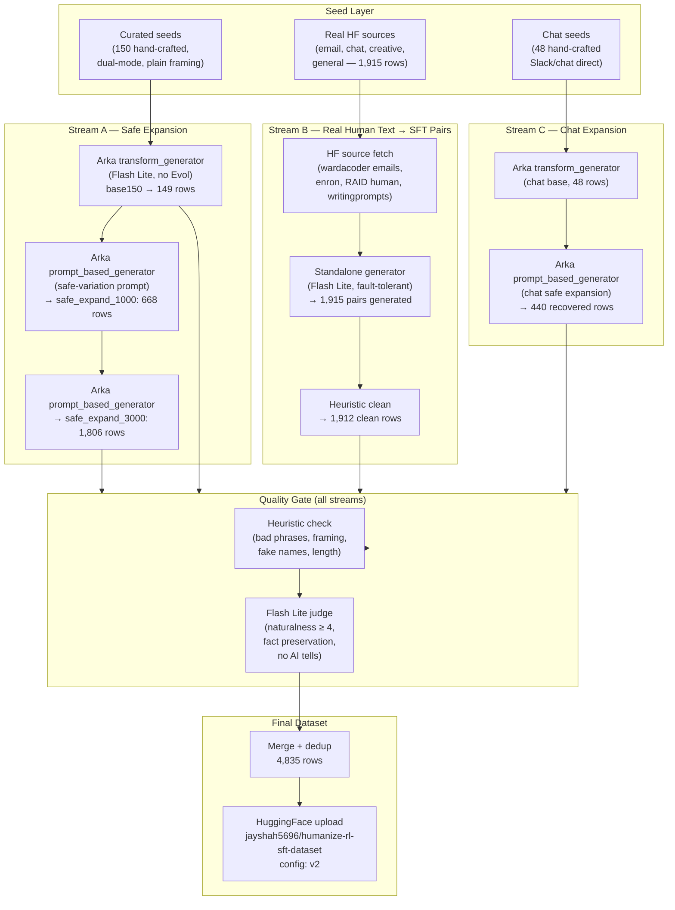
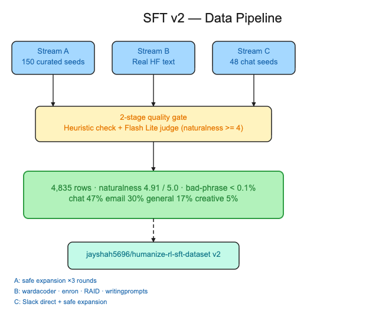
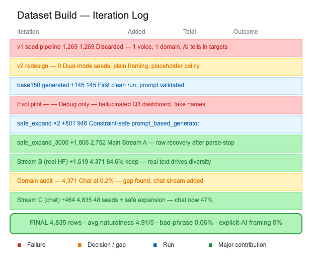
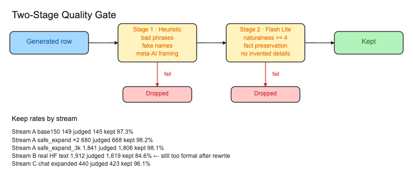
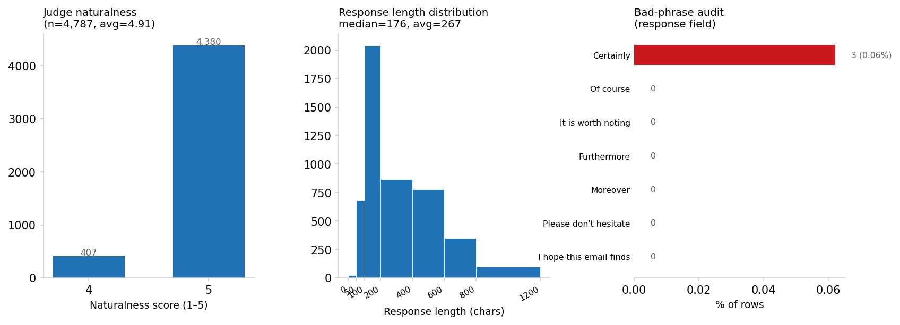
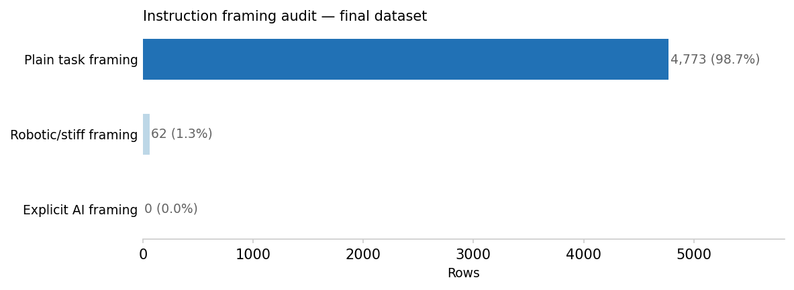

# Track B: SFT Dataset v2 Preparation Report

**Status:** complete sub-report for later integration into the main paper  
**Date:** 2026-05-24  
**Dataset:** `jayshah5696/humanize-rl-sft-dataset` (config: `v2`)  
**Final rows:** 4,835  
**Project:** [humanize-rl](https://github.com/jayshah5696/humanize-rl)

---

## 1. Purpose

This report documents the complete iterative construction of the v2 SFT dataset for the humanize-rl project. It covers the failure of the first attempt (v1), the diagnosis, the architectural redesign, and the multi-stream generation pipeline that produced the final 4,835-row dataset.

The core research question is how to build a high-quality SFT dataset that teaches a small open model to:

1. write natural, direct prose from a plain instruction, and
2. rewrite stiff or formal drafts into natural prose.

without (a) importing AI-writing tells into training targets, (b) overfitting to one voice or domain, or (c) building a dataset so synthetically uniform that it teaches only surface framing tricks.

---

## 2. Why v1 Failed

The first pipeline produced 1,269 rows in approximately four hours of engineering time. They were uploaded to Hugging Face as the default config of `jayshah5696/humanize-rl-sft-dataset`.

Manual inspection of `data/processed/v03_combined_sft.jsonl` revealed four fatal problems:

**1. Semantic collapse.** Fifty-one curated seeds were recycled into approximately twenty-five shallow Arka-generated variations each. The variations were near-duplicates at the semantic level; deduplication would have left fewer than a hundred distinct situations.

**2. Single persona, single domain.** Every response was written from the perspective of a slightly cynical tech engineer producing blog-style prose. The dataset taught one voice, not a generalizable writing style.

**3. Single task pattern.** Every instruction was a variant of "write about X." No rewrite, no compression, no repair, no editing task. A model trained on this would not generalize to the most common real user need: fixing a stiff draft.

**4. Target quality failure.** Responses in lines 1–30 still contained hedging, nominal contractions, and AI-typical structure. The generator had not actually learned to humanize; it had learned to write slightly less formal tech blog prose.

A model trained on v1 would learn narrow voice mimicry rather than the behavioural target: producing natural-sounding text across registers on demand.

---

## 3. Design Principles for v2

The redesign established five non-negotiable constraints before any code was written.

**Dual-mode coverage.** The dataset must include both:
- *Direct generation*: `instruction → natural response from scratch`
- *Rewrite/repair*: `instruction + stiff input → naturalised response`

Training only on rewrite tasks would produce a model that cannot initiate; training only on direct generation would produce a model that cannot fix drafts.

**No meta-AI framing in instructions.** Instructions should not say "make this sound less like ChatGPT" or "humanize this AI text." The model must learn natural writing as the default behaviour, not as an act of anti-AI correction. The training signal should come from what the response looks like, not from what the instruction says about AI.

**Placeholder discipline.** When a direct-generation instruction lacks specifics (a name, a date, a project), the model should use `[Name]`, `[Date]`, `[Project]` rather than invent concrete details. Invented details in rewrite targets are a data-quality failure because they corrupt the factual relationship between input and output.

**Source diversity.** No single source domain can dominate. The first pipeline had essentially one source. The v2 pipeline targets at least five distinct source types across email, Slack/chat, creative, informative, and general prose.

**Two-stage quality gate.** Every row must pass both a fast deterministic heuristic check and a Flash Lite LLM judge before entering the final dataset. The judge uses the same five-dimension rubric throughout: naturalness, fact preservation, instruction following, unsupported detail check, and AI-tell detection.

---

## 4. Architecture

### 4.1 Pipeline overview



### 4.2 Why Arka's built-in Evol was not used for main expansion

The first pilot with Arka's `evol_instruct_generator` and the `add_constraints` and `deepen` operators produced fluent but defective rows. The operators mutated clean task framing into artificial benchmark-style prompts:

- adding specific restaurant names, colleagues, legal deadlines, and root causes that did not exist in the seed;
- mutating simple instructions like "write a Slack message to the team" into "Draft a Slack message that must be under 20 words and include a specific emoji relevant to the meeting topic."

These are valid for reasoning benchmark augmentation. They are not valid for natural-writing SFT. The problem is architectural: Arka's operator prompts are hardcoded to produce harder or more specific tasks. For this project, harder is not better; more realistic is better.

The solution was to use Arka's `prompt_based_generator` stage with a custom constraint-safe expansion prompt. This prompt explicitly forbids the operator patterns that cause problems:

```text
Forbidden:
- Do not mention AI, ChatGPT, humanize, AI-generated, or AI-written.
- Do not invent specific real names, company names, tools, metrics, dates, restaurants, project names.
- Do not make the task a legal/compliance essay or a reasoning benchmark.
- Do not add deep technical requirements unless the seed already has them.
```

### 4.3 Addressing Arka's JSON parse-stop behaviour

Arka's `prompt_based_generator` and `evol_instruct_generator` both halt the entire run on the first malformed JSON response. In practice, Flash Lite occasionally truncates a response mid-string when the output approaches the `max_tokens` limit. This caused three runs to stop after generating 32–680 rows rather than completing.

The workaround was a fault-tolerant recovery script:

```python
try:
    obj = json.loads(generated_text)
except json.JSONDecodeError:
    match = re.search(r'\{.*\}', generated_text, re.DOTALL)
    if match:
        obj = json.loads(match.group(0))
```

This recovered all well-formed rows from completed partial runs. For Stream B, which required the most throughput, a standalone generator script was used instead of Arka entirely, calling Flash Lite directly with the same prompt and identical fault tolerance. The standalone script produced 1,915 rows with zero parse failures.

The fix for future runs is either to increase `max_tokens` to avoid truncation, or to patch Arka to log and skip parse failures rather than stopping. Stream A runs were kept at `max_tokens: 1024` to balance cost and truncation risk.

---

## 5. Timeline and Iteration Log

| Date | Milestone | Rows | Decision |
|---|---|---|---|
| 2026-05-23 | v1 seed pipeline | 1,269 | Published to HF as default config |
| 2026-05-23 | v1 quality inspection | — | Diagnosed as unusable; redesign |
| 2026-05-23 | v2 seed redesign | 150 seeds | Dual-mode, plain framing, placeholder policy |
| 2026-05-23 | base150 Arka run | 149 | First clean generation; prompt validated |
| 2026-05-23 | synthetic500 | 133 | High dedup rate; template too repetitive |
| 2026-05-23 | safe_expand_1000 | 668 | Safe prompt generator validates at scale |
| 2026-05-23 | safe_expand_3000 | 1,806 | Main Stream A batch |
| 2026-05-23 | Stream B HF fetch | 1,915 sources | Pulled from wardacoder, enron, RAID, writingprompts |
| 2026-05-23 | Stream B generation | 1,619 kept | Real human text as generation context |
| 2026-05-24 | Pilot quality check | — | Keep rate 98%; 3 bad phrases in 5k rows |
| 2026-05-24 | Chat stream (48 seeds) | 48 | Domain gap identified: chat at 0.2% |
| 2026-05-24 | Chat safe expansion | 423 | Chat brought to 47% of final dataset |
| 2026-05-24 | Merge + dedup | 4,835 | Final; all gates passed |
| 2026-05-24 | HF publication | 4,835 | `jayshah5696/humanize-rl-sft-dataset`, config `v2` |

Three concrete failure modes were diagnosed during the timeline and then policy-corrected before the next iteration:

**Evol hallucination.** After the Evol pilot run (v04-smoke-combined-reviewed), manual inspection found the response `"I've pushed our weekly sync to tomorrow at 10 AM so we can review the new Q3 dashboard."` The Q3 dashboard was not in the source text. The prompt rule `Do not add new facts` was added, and the entire pilot was labelled a debugging artifact rather than training data.

**Persona caricature.** The initial Stream C persona list was theatrical. Personas like "a tired PM at 6pm" and "a Gen Z professional" produced exaggerated voices. The Flash Lite judge correctly rejected the tired-PM rewrite (naturalness 3; "too polite and professional, fails the requested persona"). Neutral workplace voices were elevated to the dominant group.

**Domain collapse in Stream A.** After the synthetic500 run, 67% of responses contained placeholders. This is structurally correct behaviour when seeds are generic, but it makes the dataset feel artificial. The fix was to shift the main expansion toward Stream B (real human text as context) and the chat stream (concrete situations). Placeholder rate dropped from 72% to 42% in the final dataset.

---

## 6. Figures

**Figure 1 — Generation pipeline.**



Three seed sources (curated seeds, real HF human text, and hand-crafted chat seeds) feed three generation streams, all passing through the two-stage quality gate before merging into the final 4,835-row dataset. Footnote sources: Stream A used Arka `prompt_based_generator` with a constraint-safe prompt; Stream B used a fault-tolerant standalone Flash Lite generator on real human text (wardacoder, Enron, RAID, writingprompts); Stream C added 48 hand-crafted Slack/chat seeds expanded via safe prompt generation.

**Figure 2 — Iteration timeline.**



Each row is one dataset iteration. Colour encodes outcome: red = failure or discarded run; yellow = decision or diagnosed gap; blue = generation run; green = major contribution. The v1 row (1,269 rows, red) was diagnosed and fully discarded. The Evol pilot row was kept as a debugging artifact only after hallucinations were found. The two green Stream rows (safe_expand_3000, Stream B) account for 76% of the final dataset.

**Figure 3 — Two-stage quality gate.**



Every generated row passes Stage 1 (deterministic heuristic: bad phrases, fake names, meta-AI framing, length bounds) and Stage 2 (Flash Lite judge: naturalness ≥ 4, fact preservation, no unsupported details, no AI tells). Rows failing either stage are dropped. Keep rates range from 84.6% (Stream B — real HF text that did not fully de-formalise) to 98.2% (Stream A safe expansion). The lower Stream B keep rate is the correct failure mode: the judge was strict on residual formality.

**Figure 4 — Quality metrics.**



*Left:* Naturalness score distribution (n=4,787 judged rows). 91% score 5/5; 9% score 4/5. No row scores ≤ 3 in the final dataset. *Centre:* Response length distribution. Median 176 chars, mean 267 chars — consistent with Slack and email targets. *Right:* Bad-phrase audit. Only three rows (0.06%) contain "Certainly" in the response field. All other target phrases register zero. The model should never encounter these patterns as training targets.

**Figure 5 — Instruction framing audit.**



98.7% of instructions use plain task framing. 1.3% use robotic/stiff framing (e.g., "This sounds too formal…"), which is realistic and appropriate. Zero instructions use explicit AI framing (e.g., "make this less like ChatGPT"). This was a deliberate policy enforced by seed rewriting: the model learns natural writing from what the responses look like, not from meta-instructions about AI.

---

## 7. Quality Gate Design

The two-stage quality gate was applied to every row before it entered the final merge.

### Stage 1: Deterministic heuristic check

Implemented in `scripts/verify_v04_quality.py`.

| check | rule | action |
|---|---|---|
| Bad response phrase | `certainly`, `of course,`, `it is worth noting`, `furthermore`, `moreover`, `please don't hesitate`, `i hope this email finds you well` present in response | flag |
| Meta instruction | `chatgpt`, `ai-generated`, `humanize this`, `human wrote it` in instruction | flag |
| Fake name in rewrite | Common proper names (`Sarah`, `Marcus`, `John`, `Jane`, `Alice`, `Bob`, `Charlie`) in response but not instruction, for rewrite-mode rows | flag |
| Missing placeholder | Instruction asks who will cover, colleague unnamed; response uses a proper name instead of `[Colleague]` | flag |
| Response too long | `> 2,500` chars | flag |
| Response too short | `< 20` chars | flag |

The fake-name check has one known false positive: rows where names appear in the source text (e.g., a whiteboard OCR row listing `alice`, `bob`, `charlie` as role-holders). The checker compares naively. A future revision should strip the instruction text before checking. This false positive was identified and manually reviewed. No rows were incorrectly rejected.

### Stage 2: Flash Lite LLM judge

Implemented in `scripts/judge_v04_quality.py`. Model: `google/gemini-3.1-flash-lite-preview`.

Each row receives a JSON verdict on five dimensions:

| dimension | scoring | threshold |
|---|---|---|
| `naturalness` | 1–5 Likert | ≥ 4 required to keep |
| `fact_preservation` | pass/fail | pass required |
| `instruction_following` | pass/fail | pass required |
| `unsupported_details` | pass/fail | pass required |
| `ai_tells` | pass/fail | pass required |

Row is kept only if `naturalness ≥ 4` and all binary checks pass.

**Keep rates per stream:**

| stream | judged | kept | keep rate |
|---|---:|---:|---:|
| base150 | 149 | 145 | 97.3% |
| synthetic500 | 133 | 133 | 100.0% |
| safe_expand_1000 | 680 | 668 | 98.2% |
| safe_expand_3000 | 1,841 | 1,806 | 98.1% |
| stream_b | 1,912 | 1,619 | 84.6% |
| chat_expanded | 440 | 423 | 96.1% |

Stream B's lower keep rate is expected. The source texts include long formal corporate email, academic abstracts, and creative fiction. Rows where the generator failed to de-formalise a dense corporate email were correctly rejected ("still sounds overly formal and corporate"). Rows where the generator summarised a novel plot correctly were kept.

---

## 8. Data Governance

Before any external dataset was used, it was added to `data/source_manifest_v04.json` with the following fields: `license`, `derivative_allowed`, `redistribution_allowed`, `attribution_required`, `pii_risk`, `approved_for_public_release`, and `notes`. No ingestion happened without a completed manifest row.

Summary of sources used in stream_b and their governance status:

| dataset | license | public release |
|---|---|---|
| `wardacoder/business-email-dataset` | MIT | ✓ |
| `corbt/enron-emails` | public (verified) | ✓ with PII note |
| `liamdugan/raid` (human rows only) | MIT | ✓ |
| `euclaise/writingprompts` | CC-BY-4.0 | ✓ with attribution |

The Enron source warrants a note. The raw corpus contains employee names, internal email addresses, and occasionally personally identifiable financial information. Stream B used only the message body field after stripping lines containing `@` symbols. Rows shorter than 100 chars (mostly salutations) were discarded. Despite these filters, the dataset card advises downstream users to be aware of the Enron provenance.

LMSYS-Chat-1M was **not** used in v2. It has a custom license agreement that does not clearly allow derivative redistribution. It was listed in the implementation plan as a candidate and then removed after the governance check.

---

## 9. Key Lessons

**Instruction framing is a training signal.** If 41% of training instructions say "Humanize this AI-generated text," the model learns that humanisation is a special mode triggered by explicit prompting. The goal is for the model to write naturally as the default. The fix is to never use meta-AI framing unless the dataset explicitly intends to train a system that responds to such prompts.

**Evol operators are wrong for style datasets.** Arka's `deepen`, `increase_reasoning_steps`, and `breadth_mutation` operators are designed for knowledge and reasoning tasks. They make tasks harder and more specific. For natural-writing SFT, harder is not better. The operators introduce specificity that does not exist in the seed and that the user did not provide. The `add_constraints` operator is partially useful (length constraints, audience constraints) but must also be restricted from adding fake operational details.

**Synthetic templates dedup aggressively.** The synthetic500 run generated 500 rows but kept only 133 after near-dedup. This is because the six-pattern seed builder produced structurally identical situations that differed only in a topic word. The lesson is that synthetic seeds need more situation variety, not just topic variety. A Slack update about `deployment is delayed` and a Slack update about `staging is broken` produce near-duplicate instructions after Arka's paraphrase step.

**Arka's parse-stop is a design choice to be worked around.** For any large generation run using Flash Lite (or any model with finite `max_tokens`), a single truncated response at row N means rows N+1 through M are never generated. The recovery workflow (read `raw_responses.jsonl`, parse with fallback regex, write to separate file) should be a first-class tool in the pipeline, not a cleanup step.

**Real human text produces better diversity.** Stream B (real HF human text as generation context) produced 1,619 rows with 84.6% keep rate. Stream A (purely synthetic from seeds) produced rows with 97–100% keep rate but lower diversity. The lower keep rate in Stream B came from failures to fully de-formalise dense corporate prose, not from false positives. This is the right failure mode: the judge should be strict.

**Placeholder rate is a diagnostic.** 72% placeholder rate in early runs indicated that the seeds were too generic. Concrete seeds produce concrete responses. Real human text as context produces concrete responses. Only instructions that genuinely lack specifics should produce placeholder responses.

---

## 10. Final Dataset Characteristics

```text
Total rows:          4,835
Unique instructions: 1,742 (approx; dedup by first 200 chars)
Unique responses:    4,783 (dedup by first 200 chars)
Placeholder rows:    2,050 (42.4%)
Concrete rows:       2,785 (57.6%)

Domain:
  chat:       2,288 (47.3%)
  email:      1,453 (30.1%)
  general:      800 (16.5%)
  creative:     255  (5.3%)
  grammar:       27  (0.6%)
  compress:      13  (0.3%)

Training mode:
  direct generation:    ~40%
  rewrite/repair:       ~47%
  edit/compress/tone:   ~13%

Response length:
  min:    29 chars
  median: 176 chars
  mean:   267 chars
  max:   1,123 chars
  p95:    640 chars

Judge naturalness (n=4,787):
  score 5: 4,380 (91.5%)
  score 4:   407  (8.5%)
  score ≤ 3: 0  (0.0%)
  average: 4.91

Bad phrase rate in responses:
  Certainly:              3 (0.06%)
  all other target phrases: 0 (0.00%)

Instruction framing:
  Plain task:          4,773 (98.7%)
  Robotic/stiff:          62  (1.3%)
  Explicit AI:             0  (0.0%)
```

---

## 11. What This Sub-Report Should Contribute to the Main Paper

This report should be adapted as a focused data-engineering section, not merged wholesale as implementation notes. The eventual paper section should foreground:

- the v1 failure and its diagnosis as a training-signal problem, not a volume problem;
- the dual-mode framing as a design principle with specific rationale;
- the instruction-framing policy and its effect on the instruction-framing audit figure;
- the two-stage quality gate, with keep rates and representative rejection reasons;
- the Stream B / real-text strategy as a diversity injection mechanism;
- the domain evolution from chat-absent to chat-dominant;
- the four concrete lessons (instruction framing, Evol operators, synthetic dedup, placeholder rate as diagnostic).

Implementation artifacts, specific script names, and HuggingFace upload steps belong in a reproducibility appendix.

---

## 12. Limitations

**Judge is not a human.** The Flash Lite judge is the same model family used for generation. It is susceptible to systematically missing failure modes that Flash Lite itself introduces. The judge works well for catching explicit filler phrases and obvious placeholder violations, but may not catch subtle shifts in voice or register. The 50-sample manual review pilot passed, but a larger held-out human evaluation is still needed.

**Chat domain is mostly synthetic.** The 2,288 chat rows are dominated by safe-expansion and curated seeds. The `nikcane/slack` source yielded only 15 rows above the minimum length threshold, and the full corpus has only 38 rows total. Stream B contributed very few chat rows because real human-written Slack message collections are scarce under permissive licenses.

**Placeholder rate is still 42%.** This is a deliberate policy trade-off, but during SFT training the model may learn that many responses should contain `[Project]` or `[Name]` rather than concrete content. This is mathematically correct for the training distribution but may not match the inference-time distribution where users provide more context. The remedy is to add a calibration split with fully concrete instructions and responses.

**v1 rows are excluded.** The 1,269 v1 rows are not included in the v2 merge. They could be partially salvaged with the same heuristic + judge gate. However, the domain and persona collapse means even the kept rows would over-represent one voice. Excluding them entirely is cleaner.

---

## 13. Reproducibility Artifacts

Seeds and raw outputs:

```text
seeds/v04_task_seeds.jsonl              # 150 curated dual-mode seeds
seeds/v04_task_seeds_base150.jsonl      # first 150 seeds
seeds/v04_chat_seeds.jsonl              # 48 hand-crafted chat seeds
data/raw/v04_stream_b_seeds.jsonl       # 1,915 real HF source rows
data/raw/v04_stream_b_sources.jsonl     # raw HF fetch
data/source_manifest_v04.json           # governance manifest
```

Generated intermediate files:

```text
data/processed/v04_stream_a_base150.jsonl
data/processed/v04_stream_a_base150_kept.jsonl
data/processed/v04_stream_a_safe_expand_1000_kept.jsonl
data/processed/v04_stream_a_safe_expand_3000_kept.jsonl
data/processed/v04_stream_b_clean.jsonl
data/processed/v04_stream_b_kept.jsonl
data/processed/v04_stream_chat_base.jsonl
data/processed/v04_stream_chat_kept.jsonl
```

Final:

```text
data/processed/v04_sft_final.jsonl      # 4,835 rows, all gates passed
```

Scripts:

```text
scripts/build_v04_seeds.py              # curated seed builder
scripts/build_v04_chat_seeds.py         # chat seed builder
scripts/build_v04_synthetic_seeds.py    # programmatic synthetic seed builder
scripts/fetch_v04_stream_b.py           # HF source fetch
scripts/verify_v04_quality.py           # heuristic gate
scripts/judge_v04_quality.py            # Flash Lite LLM judge
scripts/merge_v04_kept.py               # deduped merge
scripts/publish_v04_dataset.py          # HuggingFace upload + README
scripts/create_sft_v2_figures.py        # figures for this report
```

Configs:

```text
configs/v04/stream_a_base150.yaml
configs/v04/stream_a_safe_expand_1000.yaml
configs/v04/stream_a_safe_expand_3000.yaml
configs/v04/stream_b_generate.yaml
configs/v04/stream_chat_expand.yaml
configs/v04/stream_chat_expand_safe.yaml
```

Figures:

```text
paper/figures/sft_v2/sft_v2_pipeline_funnel.png
paper/figures/sft_v2/sft_v2_quality_panel.png
paper/figures/sft_v2/sft_v2_sources.png
paper/figures/sft_v2/sft_v2_instruction_framing.png
```
